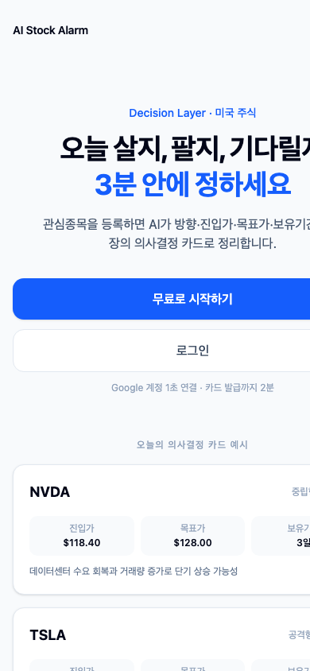
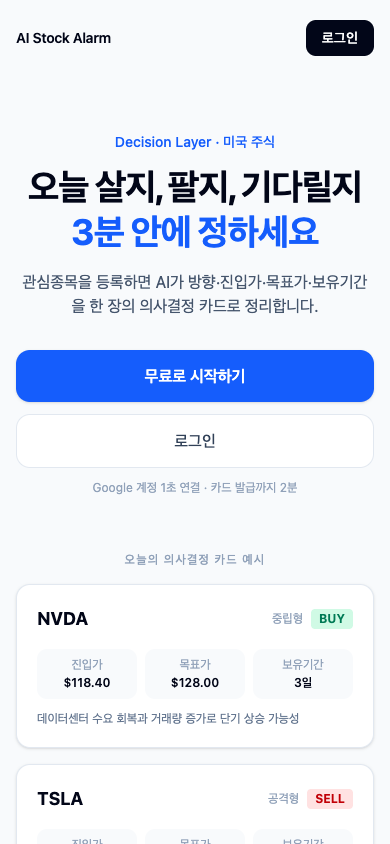
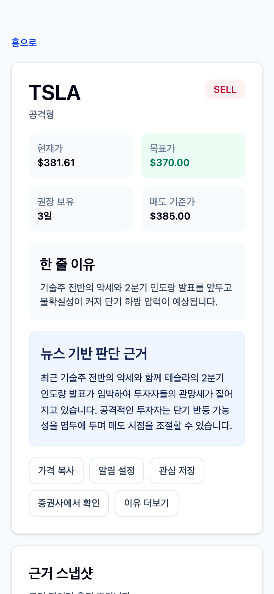
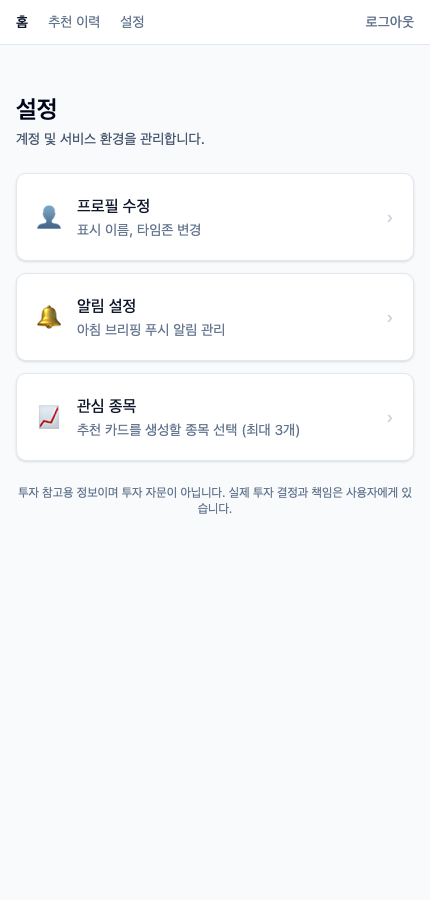
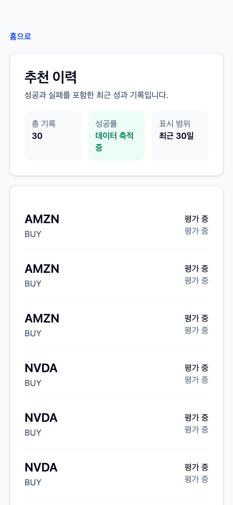
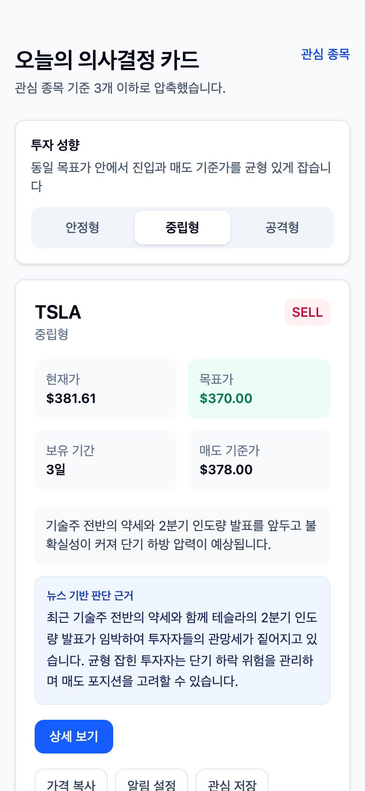

# AI Stock Alarm — Decision Layer

> 미국주식 관심종목 기준으로 AI가 오늘의 매수·매도 판단을 **1–3장 카드**로 압축합니다.  
> "리서치 45–90분 → 아침 3분 점검"

---

## 스크린샷

| 랜딩 페이지 | 홈 — 오늘의 의사결정 카드 | 추천 카드 상세 |
|:---:|:---:|:---:|
|  |  |  |

| 설정 허브 | 추천 이력 | 리스크 모드 선택 |
|:---:|:---:|:---:|
|  |  |  |

---

## 핵심 기능

| 기능 | 설명 |
|------|------|
| **AI 추천 카드** | Gemini 2.5 Flash가 BUY/SELL 방향, 진입가, 목표가, 손절가, 보유 기간, 한 줄 이유를 생성 |
| **자동 생성** | 접속 날짜 기준으로 카드 자동 생성 — 별도 버튼 조작 없이 오늘 카드 즉시 확인 |
| **뉴스 기반 근거** | 최근 3일 뉴스 최대 5개 기사를 개별 카드(헤드라인 클릭 시 원문 링크 + 요약 + 출처 + 날짜)로 표시 |
| **현재가 타임스탬프** | 현재가 셀에 카드 생성 시각을 ET 기준(`M. D. HH:mm ET 기준`)으로 표시 |
| **가격 차트** | 1개월 OHLCV 직선 차트 — 카드에서 접기/펼치기 토글 |
| **가격 DB 캐싱** | `TickerPriceHistory`에 일별 저장 → 누락 기간 자동 gap-fill |
| **리스크 모드** | 안정형 / 중립형 / 공격형 — 선택 시 카드 필터·숫자 실시간 반영 |
| **No Call** | 시장 조건이 명확하지 않으면 추천 생성 없이 이유 표시 |
| **Trust Layer** | 과거 카드의 적중률·실현 수익률을 이력에 공개 |
| **랜딩 페이지** | 미인증 사용자도 `/`에서 서비스 소개 확인 가능 |
| **글로벌 네비게이션** | 홈·추천 이력·설정·로그아웃이 sticky 상단 바에 항상 표시 |
| **Google 로그인** | NextAuth v4 Google OAuth |
| **관심종목 확장 선택** | 시총 50위 섹터별 그리드 + 실시간 검색 (DB 우선, Yahoo Finance 폴백) |
| **관심종목 변경 즉시 반영** | 종목 변경 저장 후 홈 이동 시 추천 카드 자동 재생성 |

---

## 기술 스택

| 레이어 | 기술 |
|--------|------|
| Framework | Next.js 14 (App Router) |
| UI | Tailwind CSS v4 + shadcn/ui + Radix UI + recharts |
| Auth | NextAuth v4 (Google OAuth) + `@auth/prisma-adapter` |
| DB | PostgreSQL (Supabase) + Prisma ORM |
| LLM | Gemini 2.5 Flash via Vercel AI SDK (`@ai-sdk/google`) |
| Market Data | Yahoo Finance (OHLCV, 1mo, 종목 검색) · Finnhub (뉴스) |
| Analytics | PostHog (client + server) |
| Push | OneSignal Web Push *(현재 비활성 — PUSH_DISABLED)* |
| Deployment | Vercel (Fluid Compute + Cron) |

---

## 앱 라우트

| 경로 | 화면 |
|------|------|
| `/` | 공개 랜딩 페이지 (미인증) / 오늘의 의사결정 카드 (인증) |
| `/login` | Google 로그인 |
| `/onboarding` | 관심 종목 선택 (최대 3개) |
| `/recommendations/[recId]` | 추천 카드 상세 (1개월 가격 차트 + 뉴스 근거 + 성과 이력) |
| `/archive` | 추천 이력 + 성과 기록 + 가격 분석 |
| `/settings` | 설정 허브 (프로필 수정 / 알림 설정 / 관심 종목) |
| `/settings/profile` | 표시 이름·타임존 수정 |
| `/settings/notifications` | 푸시 알림 설정 *(준비 중)* |
| `/settings/watchlist` | 관심 종목 수정 (검색 + 시총 50위 그리드) |

---

## API 엔드포인트

| 경로 | 역할 |
|------|------|
| `GET /api/price/[ticker]` | 가격 OHLCV (DB 캐시 우선 · 누락 기간 자동 gap-fill) |
| `GET /api/ticker-search?q=` | 종목 검색 (DB 우선, Yahoo Finance 폴백, 신규 티커 자동 저장) |
| `POST /api/cron/generate-recommendations` | AI 추천 카드 생성 (평일 05:00 KST) |
| `POST /api/cron/morning-briefing` | 아침 OneSignal 푸시 발송 (평일 07:00 KST) |
| `POST /api/cron/evaluate-performance` | 이전 카드 성과 평가 (평일 06:00 KST) |
| `POST /api/dev/generate-recommendations` | 수동 추천 생성 (인증 필요, `force: true` 옵션) |
| `POST /api/dev/evaluate-performance` | 수동 성과 평가 트리거 (인증 필요) |
| `GET /api/admin/health` | 헬스체크 + 마지막 동기화 타임스탬프 |

> Cron 스케줄은 `vercel.json`에서 UTC 기준으로 관리됩니다.

---

## 데이터 모델 (Prisma)

```
User ──< Watchlist             (관심 종목/섹터, 최대 3개)
User ── RiskProfile            (안정형/중립형/공격형)
User ──< RecommendationCard    (AI 추천 카드)
         ├── newsItems Json?       (뉴스 기사 3~5개: source·headlineKo·summaryKo·url·publishedAt)
         ├──< EvidenceSnapshot     (뉴스·볼륨·커뮤니티 신호)
         └──< PerformanceRecord    (실현 수익률, 적중 여부)
TickerPriceHistory             (종목별 일별 OHLCV — gap-fill 캐시)
TickerUniverse                 (검색 가능 티커 목록 — 시총 50위 시드 포함)
```

### TickerPriceHistory

일별 가격을 DB에 보관하여 Yahoo Finance 중복 호출을 최소화합니다.

- 접속 시 `syncPriceHistory(ticker)` 호출
- 마지막 저장일 < 오늘 → 누락 기간만 Yahoo `period1/period2` fetch
- 마지막 저장일 = 오늘 → DB 직접 서빙 (Yahoo OHLCV 호출 없음)

### TickerUniverse

검색 성능을 위해 티커 목록을 DB에 관리합니다.

- 초기 시드: 미국 시총 50위 기업 (섹터별 분류, `marketCapRank` 1–50)
- `/api/ticker-search` 에서 DB 우선 검색 → 없으면 Yahoo Finance 검색 후 자동 upsert
- 재실행: `node prisma/seed-ticker-universe.mjs`

---

## 서버 액션

| 액션 | 역할 |
|------|------|
| `saveWatchlist` | 관심 종목 저장 (watchlist 전체 교체) |
| `saveRiskProfile` | 리스크 모드 저장 (aggressive / balanced / conservative) |
| `updateProfile` | 표시 이름·타임존 수정 |
| `savePushConsent` | 푸시 알림 수신 동의 저장 |
| `resetTodayCards` | 오늘 생성된 추천 카드 삭제 → 홈에서 자동 재생성 트리거 |
| `deleteAccount` | 계정 및 모든 데이터 삭제 |

---

## 환경 변수

`.env.example`을 복사하고 각 값을 채워주세요.

```bash
cp .env.example .env.local
```

| 변수 | 설명 |
|------|------|
| `DATABASE_URL` | Supabase pgBouncer (포트 6543) — Prisma Client 용 |
| `POSTGRES_URL` | Supabase 직접 연결 (포트 5432) — 마이그레이션 용 |
| `NEXTAUTH_SECRET` | NextAuth 서명 비밀키 |
| `NEXTAUTH_URL` | 앱 URL (로컬: `http://localhost:3000`) |
| `GOOGLE_CLIENT_ID` | Google OAuth 클라이언트 ID |
| `GOOGLE_CLIENT_SECRET` | Google OAuth 클라이언트 시크릿 |
| `GEMINI_API_KEY` | Google AI Studio API 키 |
| `GEMINI_MODEL` | 사용할 Gemini 모델 (기본값: `gemini-2.5-flash`) |
| `FINNHUB_API_KEY` | Finnhub 뉴스 API 키 (선택 — 없으면 뉴스 신호 생략) |
| `NEXT_PUBLIC_POSTHOG_KEY` | PostHog 프로젝트 API 키 |
| `NEXT_PUBLIC_POSTHOG_HOST` | PostHog 호스트 |
| `NEXT_PUBLIC_ONESIGNAL_APP_ID` | OneSignal 앱 ID *(현재 비활성)* |
| `ONESIGNAL_REST_API_KEY` | OneSignal REST API 키 *(현재 비활성)* |
| `CRON_SECRET` | Cron 핸들러 인증 시크릿 |

> `FINNHUB_API_KEY`가 없으면 Yahoo Finance가 가격 데이터 폴백으로 사용됩니다.  
> 뉴스 신호는 생략되고 LLM은 가격 데이터만으로 판단합니다.

---

## 로컬 실행

```bash
# 1. 의존성 설치
npm install

# 2. 환경 변수 설정
cp .env.example .env.local
# .env.local 편집 후 DB/API 키 입력

# 3. Prisma 마이그레이션
npx prisma migrate dev

# 4. 티커 유니버스 시드 (시총 50위)
node prisma/seed-ticker-universe.mjs

# 5. 개발 서버 실행
npm run dev
```

개발 서버: `http://localhost:3000`

---

## 빌드 & 배포

```bash
# 타입 검사
npm run typecheck

# 프로덕션 빌드
npm run build

# 로컬 프로덕션 서버
npm start
```

Vercel 배포는 `main` 브랜치 푸시 시 자동 실행됩니다.

---

## 설계 원칙

### Decision Layer
뉴스 요약이 아닌, 사용자가 바로 판단할 수 있는 **행동 카드** 중심 UI를 지향합니다.  
방향 → 현재가(ET 기준 시각) → 목표가 → 손절가 → 보유 기간 → 한 줄 이유 순으로 먼저 보여줍니다.

### Chartless Primary UI (ADR-004)
차트는 보조 정보입니다. 홈 카드에서는 접기/펼치기 토글 안에 배치하고, 상세 페이지에서도 판단 정보 아래에 위치합니다.

### Risk Choice UX
리스크 모드는 단순 배지가 아니라 사용자가 직접 선택하는 필터 기준입니다.  
`안정형 / 중립형 / 공격형` 변경 시 추천 숫자와 액션이 함께 바뀝니다.

### Trust Layer
성공 이력만 보여주지 않습니다.  
실패 기록, 평균 수익률, No Call 판단 이유를 함께 노출합니다.

### DB-first Cache
Yahoo Finance 호출을 최소화합니다.
- `TickerPriceHistory`: 일별 OHLCV — 같은 날 두 번째 접속부터 DB 서빙
- `TickerUniverse`: 검색 결과 캐싱 — 신규 티커도 첫 검색 후 DB에 자동 저장

---

## 문서

| 문서 | 위치 |
|------|------|
| Product Requirements (PRD) | [`docs/PRD_v1.md`](./docs/PRD_v1.md) |
| Software Requirements (SRS) | [`docs/SRS-v1.md`](./docs/SRS-v1.md) |
| 랜딩페이지 평가 | [`docs/landing-page-checklist-evaluation.md`](./docs/landing-page-checklist-evaluation.md) |
| 작업 로그 | [`docs/work-log-*.md`](./docs/) |
