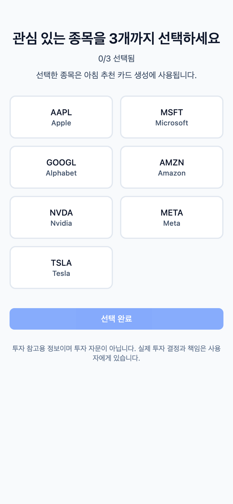

# AI Stock Alarm — Decision Layer

> 미국주식 관심종목 기준으로 AI가 오늘의 매수·매도 판단을 **1–3장 카드**로 압축합니다.  
> "리서치 45–90분 → 아침 3분 점검"

---

## 스크린샷

<!-- 스크린샷 추가 방법: public/screenshots/ 에 이미지를 넣고 아래 경로를 업데이트하세요 -->

| 홈 — 오늘의 의사결정 카드 | 추천 카드 상세 | 리스크 모드 선택 |
|:---:|:---:|:---:|
|  |  |  |

| 관심종목 온보딩 | 추천 이력 | 설정 |
|:---:|:---:|:---:|
|  |  |  |

> **이미지가 표시되지 않으면** `public/screenshots/` 폴더에 캡처 이미지를 추가해주세요.

---

## 핵심 기능

| 기능 | 설명 |
|------|------|
| **AI 추천 카드** | Gemini 2.5 Flash가 BUY/SELL 방향, 진입가, 목표가, 손절가, 보유 기간, 한 줄 이유를 생성 |
| **리스크 모드** | 안정형 / 중립형 / 공격형 — 선택 시 카드 필터·숫자 실시간 반영 |
| **No Call** | 시장 조건이 명확하지 않으면 추천 생성 없이 이유 표시 |
| **Trust Layer** | 과거 카드의 적중률·실현 수익률을 이력에 공개 |
| **아침 푸시** | OneSignal 웹 푸시로 매일 아침 추천 브리핑 (평일 07:00 KST) |
| **Google 로그인** | NextAuth v4 Google OAuth |
| **관심종목** | 티커 또는 섹터 최대 3개 등록, 설정에서 언제든 수정 |

---

## 기술 스택

| 레이어 | 기술 |
|--------|------|
| Framework | Next.js 14 (App Router) |
| UI | Tailwind CSS v4 + shadcn/ui + Radix UI |
| Auth | NextAuth v4 (Google OAuth) + `@auth/prisma-adapter` |
| DB | PostgreSQL (Supabase) + Prisma ORM |
| LLM | Gemini 2.5 Flash via Vercel AI SDK (`@ai-sdk/google`) |
| Analytics | PostHog (client + server) |
| Push | OneSignal Web Push |
| Deployment | Vercel (Fluid Compute + Cron) |

---

## 앱 라우트

| 경로 | 화면 |
|------|------|
| `/` | 오늘의 의사결정 카드 (홈) |
| `/login` | Google 로그인 |
| `/onboarding` | 관심 종목/섹터 선택 (최대 3개) |
| `/recommendations/[recId]` | 추천 카드 상세 (차트 없는 판단 정보 중심) |
| `/archive` | 추천 이력 + 성과 기록 |
| `/settings` | 관심 종목 수정, 리스크 성향, 푸시 수신 토글 |

---

## API 엔드포인트

| 경로 | 역할 |
|------|------|
| `POST /api/cron/generate-recommendations` | AI 추천 카드 생성 (평일 05:00 KST) |
| `POST /api/cron/morning-briefing` | 아침 OneSignal 푸시 발송 (평일 07:00 KST) |
| `POST /api/cron/evaluate-performance` | 이전 카드 성과 평가 (평일 06:00 KST) |
| `POST /api/dev/generate-recommendations` | 개발용 수동 추천 생성 (인증 필요) |
| `GET /api/admin/health` | 헬스체크 + 마지막 동기화 타임스탬프 |

> Cron 스케줄은 `vercel.json`에서 UTC 기준으로 관리됩니다.

---

## 데이터 모델 (Prisma)

```
User ──< Watchlist          (관심 종목/섹터, 최대 3개)
User ── RiskProfile         (안정형/중립형/공격형)
User ──< RecommendationCard (AI 추천 카드)
         ├──< EvidenceSnapshot   (뉴스·볼륨·커뮤니티 신호)
         └──< PerformanceRecord  (실현 수익률, 적중 여부)
```

---

## 환경 변수

`.env.example`을 복사하고 각 값을 채워주세요.

```bash
cp .env.example .env.local
```

| 변수 | 설명 |
|------|------|
| `DATABASE_URL` | Supabase pgBouncer (포트 6543) — Prisma Client 용 |
| `POSTGRES_URL` | Supabase 직접 연결 (포트 5432) — 마이그레이션 용 |
| `NEXTAUTH_SECRET` | NextAuth 서명 비밀키 |
| `NEXTAUTH_URL` | 앱 URL (로컬: `http://localhost:3000`) |
| `GOOGLE_CLIENT_ID` | Google OAuth 클라이언트 ID |
| `GOOGLE_CLIENT_SECRET` | Google OAuth 클라이언트 시크릿 |
| `GEMINI_API_KEY` | Google AI Studio API 키 |
| `GEMINI_MODEL` | 사용할 Gemini 모델 (기본값: `gemini-2.5-flash`) |
| `FINNHUB_API_KEY` | Finnhub 시장 데이터 API 키 |
| `NEXT_PUBLIC_POSTHOG_KEY` | PostHog 프로젝트 API 키 |
| `NEXT_PUBLIC_POSTHOG_HOST` | PostHog 호스트 |
| `NEXT_PUBLIC_ONESIGNAL_APP_ID` | OneSignal 앱 ID |
| `ONESIGNAL_REST_API_KEY` | OneSignal REST API 키 (서버 전용) |
| `CRON_SECRET` | Cron 핸들러 인증 시크릿 |

---

## 로컬 실행

```bash
# 1. 의존성 설치
npm install

# 2. 환경 변수 설정
cp .env.example .env.local
# .env.local 편집 후 DB/API 키 입력

# 3. Prisma 마이그레이션
npx prisma migrate dev

# 4. 개발 서버 실행
npm run dev
```

개발 서버: `http://localhost:3000`

---

## 빌드 & 배포

```bash
# 타입 검사
npm run typecheck

# 프로덕션 빌드
npm run build

# 로컬 프로덕션 서버
npm start
```

Vercel 배포는 `main` 브랜치 푸시 시 자동 실행됩니다.

---

## 설계 원칙

### Decision Layer
뉴스 요약이 아닌, 사용자가 바로 판단할 수 있는 **행동 카드** 중심 UI를 지향합니다.

### Chartless UI
상세 화면 핵심 폴드에 차트·RSI·MACD 같은 원본 지표를 두지 않습니다.  
방향 → 진입가 → 목표가 → 손절가 → 보유 기간 → 한 줄 이유 순으로 먼저 보여줍니다.

### Risk Choice UX
리스크 모드는 단순 배지가 아니라 사용자가 직접 선택하는 필터 기준입니다.  
`안정형 / 중립형 / 공격형` 변경 시 추천 숫자와 액션이 함께 바뀝니다.

### Trust Layer
성공 이력만 보여주지 않습니다.  
실패 기록, 평균 수익률, No Call 판단 이유를 함께 노출합니다.

---

## 문서

| 문서 | 위치 |
|------|------|
| Product Requirements (PRD) | [`docs/PRD_v1.md`](./docs/PRD_v1.md) |
| Software Requirements (SRS) | [`docs/SRS-v1.md`](./docs/SRS-v1.md) |
| 랜딩페이지 평가 | [`docs/landing-page-checklist-evaluation.md`](./docs/landing-page-checklist-evaluation.md) |
| 작업 로그 | [`docs/work-log-*.md`](./docs/) |
