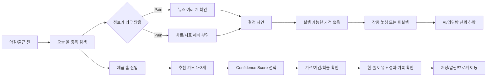
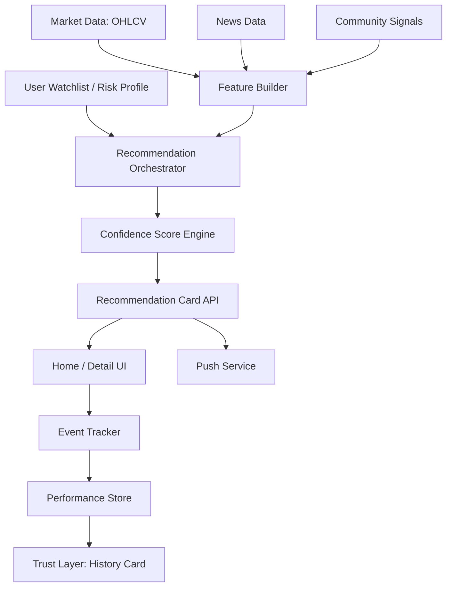

# 미국주식 리스크-맞춤 의사결정 인터페이스 PRD v1.0
- Owner 팀: Decision Layer Product
- 버전: v1.0
- 최종 업데이트: 2026-04-14

> 작성 기준: 본 PRD는 VPS(Value Proposition & MVP Feature Map) 문서, 통합 문제정의, KSF, 경쟁/가치사슬 분석, 그리고 승인된 ADR 5개를 반영한 최종 정렬본이다.  
> 문서 목적: 제품 정의, 범위, 수용 기준, 실험, 운영 지표, 아키텍처 의사결정을 하나의 실행 문서로 통합한다.  
> 주의: 외부 대안 비교 수치와 일부 기준선은 **베타 검증 전 초기 가설치**이며, 4주 Closed Beta 종료 후 재보정한다.

## 1. 개요·목표

### 1.1 문제 정의(Pain 지표 포함)
제품이 해결하려는 핵심 문제는 “정보를 많이 읽고 차트를 오래 봐도, 바쁜 직장인 투자자가 결국 실행 가능한 숫자와 확신을 얻지 못한다”는 점이다.

| Pain ID | Pain | Needs | 실패 KPI(현재 상태 가설) | 측정 경로 | 판정 규칙 |
|---|---|---|---:|---|---|
| P1 | 정보 과잉으로 탐색 피로가 높다 | 오늘 볼 가치가 있는 종목을 1~3개로 빠르게 압축 | 추천 카드 CTR < 35% 또는 첫 추천 도달 시간 > 90초 | `home_view`, `rec_card_impression`, `rec_card_click` | 홈 진입 후 90초 내 카드 미확인 세션을 실패로 집계 |
| P2 | 차트/지표 해석이 어렵다 | 차트 없이도 방향·가격·기간을 이해 | 상세 진입률 < 40% 또는 “판단이 쉬웠다” < 3.5/5 | `rec_detail_view`, UX 설문 | 상세 5초 이상 체류 세션만 설문 분석 대상 포함 |
| P3 | 실행 가능한 가격·시점이 없다 | 바로 예약주문 가능한 숫자 제공 | 가격 제안 포함 카드 비율 < 95% 또는 실행 의향률 < 25% | 카드 스키마 검증, `broker_redirect`, `price_copy`, 설문 | 가격/기간 누락 카드 1장이라도 있으면 품질 결함으로 기록 |
| P4 | 리스크 선택 구조가 없다 | 공격형/중립형/안정형을 직접 선택 | Confidence Score 조작률 < 30% | `confidence_view`, `confidence_change` | 카드 노출 대비 1회 이상 변경 사용자 비율로 집계 |
| P5 | AI 결과가 블랙박스처럼 느껴진다 | 최소한의 근거와 성과 이력 확인 | 이유 설명 열람률 < 45% 또는 성과 카드 열람률 < 35% | `reason_expand`, `performance_card_view` | 상세 진입 세션만 분모로 사용 |
| P6 | 장중 대응이 어렵다 | 아침에 미리 실행 후보를 받고 싶다 | 푸시 오픈율 < 20% 또는 아침 브리핑 재방문율 < 18% | `push_sent`, `push_open`, `session_start` | 푸시 발송 성공건만 오픈율 분모에 포함 |
| P7 | 반복 사용 루틴이 약하다 | 성향 저장과 관심 종목 중심 루틴 형성 | D7 리텐션 < 22% 또는 주간 재방문율 < 30% | `session_start`, 코호트 테이블 | 내부 테스트 계정과 1회성 QA 세션 제외 |

### 1.2 목표(Desired Outcome 수치화)
핵심 목표는 사용자가 복잡한 정보 해석 없이도 **오늘 무엇을, 어떤 확률로, 얼마에, 얼마나 들고 갈지**를 빠르게 선택하게 만드는 것이다.

#### 북극성 KPI
| KPI ID | KPI 명 | 정의/계산식 | 기준선 | 목표값 | 측정 경로 | 제외 조건 | 측정 주기 |
|---|---|---|---:|---:|---|---|---|
| NS-01 | Actionable Decision Rate (ADR) | `24시간 내 actionable_event 발생 사용자 수 / rec_card_view 사용자 수` | 18% | 35% | 이벤트 테이블: `rec_card_view`, `bookmark_add`, `alert_set`, `broker_redirect`, `execution_intent_submit` | 내부 계정, 비정상 세션, 중복 로그인 봇 | 주간 |

> `actionable_event` 는 저장, 알림설정, 브로커 이동, 가격 복사, 실행 의향 제출 중 1개 이상 발생을 의미한다.

#### 보조 KPI
| KPI ID | KPI 명 | 정의/계산식 | 기준선 | 목표값 | 측정 경로 | 제외 조건 | 측정 주기 |
|---|---|---|---:|---:|---|---|---|
| SU-01 | 추천 카드 CTR | `rec_card_click / rec_card_impression` | 34% | 55% | `rec_card_impression`, `rec_card_click` | 홈 최초 로드 실패 세션 제외 | 일간/주간 |
| SU-02 | First Decision Time | `min(actionable_event_ts - home_view_ts)`의 중앙값 | 8분 | 3분 이하 | `home_view`, actionable events | 앱 백그라운드 30분 초과 세션 제외 | 주간 |
| SU-03 | Confidence Engagement Rate | `confidence_change user / confidence_view user` | 22% | 45% | `confidence_view`, `confidence_change` | 카드가 No Call 상태인 세션 제외 | 주간 |
| SU-04 | Price Completeness | `가격·기간·신뢰도 포함 카드 수 / 전체 카드 수` | 72% | 95% | 카드 배치 검증 로그 | 실험용 더미 카드 제외 | 일간 |
| SU-05 | Performance Card View Rate | `performance_card_view / rec_detail_view` | 33% | 55% | `rec_detail_view`, `performance_card_view` | 3초 미만 이탈 세션 제외 | 주간 |
| SU-06 | D7 Retention | `가입 후 7일 내 2회 이상 방문 사용자 / 신규 사용자` | 22% | 30% | `signup_complete`, `session_start` | QA 계정 제외 | 주간 코호트 |
| SU-07 | D30 Retention | `가입 후 30일 내 3회 이상 방문 사용자 / 신규 사용자` | 8% | 15% | `signup_complete`, `session_start` | QA 계정 제외 | 월간 코호트 |
| SU-08 | Decision Confidence Score | “의사결정이 빨라졌다” 설문 평균 | 3.2/5 | 4.2/5 | 인앱 설문 | 표본 수 30 미만 주차는 참고치 처리 | 격주 |

### 1.3 성공 지표 해석 원칙
- **NS-01 ADR** 을 제품의 단일 북극성 지표로 사용한다.
- 설문형 KPI는 행동형 KPI를 대체하지 않으며, 보조 설명용으로만 사용한다.
- KPI 해석 우선순위는 `행동 로그 > 실험 결과 > 설문 결과` 순서다.
- 기준선은 Closed Beta 1주차 종료 후 재설정할 수 있다. 단, 목표값 변경은 PM/분석/개발 리드 합의가 필요하다.

### 1.4 제품 원칙
- 우리는 뉴스 요약 서비스가 아니라 **의사결정 인터페이스**를 만든다.
- 우리는 차트를 더 많이 보여주지 않고, **차트를 감춘 결과 중심 UI**를 제공한다.
- 우리는 “정답”을 강요하지 않고, **리스크 선택 구조**를 제공한다.
- 우리는 AI를 신비화하지 않고, **근거·성과 이력·실패 기록**을 함께 보여준다.

### 1.5 아키텍처 의사결정 정렬(ADR Alignment)
본 PRD는 아래 5개 승인된 아키텍처 의사결정을 상위 원칙으로 따른다.

| ADR ID | 결정 내용 | PRD 반영 위치 | 제품 의미 |
|---|---|---|---|
| ADR-001 | 제품을 정보 제공 서비스가 아니라 **Decision Layer** 로 정의 | 1장, 3장, 4장 | 핵심 출력은 정보가 아니라 행동 카드 |
| ADR-002 | **Confidence Score 기반 선택형 UX** 채택 | 3장, 4장, 6장 | 추천이 아니라 사용자의 리스크 선택 구조 |
| ADR-003 | 예측 범위를 **3~5 영업일** 로 제한 | 3장, 4장, 6장, 8장 | 예약 주문 친화적 스윙 의사결정에 집중 |
| ADR-004 | **차트/지표 중심 UI 배제**, 결과 중심 UI 채택 | 2장, 3장, 4장, 5장 | De-complexing UX를 기본값으로 유지 |
| ADR-005 | 신뢰 확보를 위해 **성과 공개형 Trust Layer** 를 MVP에 포함 | 3장, 4장, 6장, 8장, 9장 | 실패 포함 예측 이력 공개를 기본 원칙으로 채택 |

### 1.6 제품 의사결정 게이트
신규 기능 또는 범위 변경 제안은 아래 5문항으로 1차 검토한다.
1. 이 기능이 Decision Layer를 강화하는가?
2. 사용자의 리스크 선택권을 강화하는가?
3. 3~5일 실행 맥락과 맞는가?
4. 복잡도를 낮추는가, 높이는가?
5. 신뢰를 데이터로 증명하는 구조에 기여하는가?

위 5문항 중 2개 이상에 명확히 반하면, 본 PRD 기준에서는 기본적으로 보류한다.

---

## 2. 사용자와 페르소나

### 2.1 핵심 페르소나
| 페르소나 | 특징 | 핵심 Pain | 핵심 Needs |
|---|---|---|---|
| 바쁜 직장인 서학개미 | 한국 거주, 미국장 실시간 대응이 어렵고 예약주문 사용 | 정보 과잉, 장중 대응 불가 | 아침에 1~3개 후보, 바로 주문 가능한 숫자 |
| 준경험 투자자 | 뉴스/유튜브는 보지만 차트 해석은 약함 | 차트 복잡성, 확신 부족 | 방향·가격·기간을 한 장으로 이해 |
| 불신형 유료 독자 | 리딩방/유튜버 경험은 있으나 맹신은 원치 않음 | 검증 부재, 책임 공백 | 확률·성과 이력·한 줄 이유 |

### 2.2 페르소나별 여정과 Pain·Needs 연결

### 2.3 페르소나별 핵심 연결
- **직장인 서학개미**는 `탐색 시간 단축`과 `아침 브리핑`이 핵심이다.
- **준경험 투자자**는 `차트를 숨긴 결과 중심 UI`와 `가격/기간 명시`가 핵심이다.
- **불신형 유료 독자**는 `성과 이력 공개`와 `실패 기록 포함`이 핵심이다.

---

## 3. 사용자 스토리와 수용 기준(AC, Acceptance Criteria)

> 아래 AC는 **릴리즈 게이트용 QA/기능 수용 기준**이다.  
> 운영 KPI와 성장 지표는 1장과 8장에서 별도로 검증한다.

### Story 1. 핵심 후보 압축
**As a** 바쁜 직장인 투자자, **I want** 오늘 볼 가치가 있는 종목을 1~3개로 빠르게 압축해서 보고 싶다, **so that** 장 시작 전 3분 내에 실행 후보를 정할 수 있다.

- **AC1-1 정상 흐름**  
  **Given** 사용자가 관심 종목 또는 섹터를 1개 이상 저장했고  
  **When** 홈 화면에 진입하면  
  **Then** 추천 카드 API는 **3개 이하 카드**를 반환해야 하며, 응답 p95는 **800ms 이하** 여야 한다.  
  **측정 경로:** API 모니터링 `GET /v1/recommendations/today`, APM 대시보드
- **AC1-2 데이터 부족 예외**  
  **Given** 가격 또는 뉴스 입력이 최소 생성 조건을 만족하지 못했고  
  **When** 추천 카드 생성을 시도하면  
  **Then** 시스템은 빈 카드 대신 **No Call 상태 카드 1장** 또는 대체 안내 문구를 반환해야 하며, HTTP 5xx를 발생시키지 않아야 한다.  
  **측정 경로:** 추천 생성 로그, `rec_generation_result=no_call`
- **AC1-3 노출 규칙**  
  **Given** 추천 카드가 생성되었고  
  **When** 홈 UI에 렌더링되면  
  **Then** 카드 1장당 `ticker`, `direction`, `confidence_score` 필드는 **100% 필수** 이어야 한다.  
  **측정 경로:** 응답 스키마 검증, 프런트 런타임 검사

### Story 2. 차트 없는 결과 해석
**As a** 차트 해석이 익숙하지 않은 투자자, **I want** 방향·가격·기간을 한 장의 카드로 이해하고 싶다, **so that** 지표 공부 없이도 판단할 수 있다.

- **AC2-1 필수 정보 표시**  
  **Given** 카드가 정상 생성되었고  
  **When** 사용자가 추천 카드를 보면  
  **Then** 카드에는 `direction`, `entry_price or range`, `hold_days`, `confidence_score`, `reason_line` 이 모두 표시되어야 한다.  
  **측정 경로:** 스냅샷 테스트, UI 회귀 테스트
- **AC2-2 렌더링 성능**  
  **Given** 추천 카드 상세 화면을 요청했고  
  **When** 상세 페이지가 렌더링되면  
  **Then** p95 렌더링 시간은 **700ms 이하**, 프런트 에러율은 **0.5% 미만** 이어야 한다.  
  **측정 경로:** RUM 대시보드, 프런트 오류 로깅
- **AC2-3 차트 노출 제한**  
  **Given** v1.0 범위에서 상세 화면이 열렸고  
  **When** 사용자가 추천 상세를 확인하면  
  **Then** 메인 폴드 영역에는 캔들 차트, RSI, MACD 등 **원본 차트 위젯이 노출되지 않아야 한다**.  
  **측정 경로:** 디자인 QA 체크리스트, 시각 회귀 테스트

### Story 3. 실행 가능한 숫자 확보
**As a** 예약주문 중심 투자자, **I want** 바로 입력 가능한 매수/매도 가격과 보유 기간을 받고 싶다, **so that** 장중 대응이 어렵더라도 실행을 미리 준비할 수 있다.

- **AC3-1 가격 정보 완전성**  
  **Given** 추천 카드가 생성되었고  
  **When** 사용자에게 노출되면  
  **Then** 카드에는 `entry_price` 와 `target_price` 또는 `entry_range` 와 `target_range` 중 하나가 반드시 있어야 하며, `hold_days` 는 **1~10일 정수값** 이어야 한다.  
  **측정 경로:** 추천 스키마 검증, 배치 결과 리포트
- **AC3-2 잘못된 가격 방지**  
  **Given** 입력 데이터 이상으로 가격이 0 이하 또는 비정상 급등락 범위로 산출되었고  
  **When** 카드 게시 전 검증을 수행하면  
  **Then** 해당 카드는 게시되지 않아야 하며 `rec_validation_failed` 이벤트가 남아야 한다.  
  **측정 경로:** 검증 로그, 배치 실패 알림
- **AC3-3 상호작용 성능**  
  **Given** 사용자가 가격 복사 또는 브로커 이동 버튼을 눌렀고  
  **When** 시스템이 요청을 처리하면  
  **Then** 클릭 후 응답 시간은 **1초 이하**, 이벤트 누락률은 **1% 미만** 이어야 한다.  
  **측정 경로:** `price_copy`, `broker_redirect`, 클라이언트 ACK 로그

### Story 4. 리스크 성향 반영
**As a** 성향이 다른 투자자, **I want** 공격형/중립형/안정형 중 하나를 선택해 출력값을 바꾸고 싶다, **so that** 추천이 아니라 내 선택이라는 감각을 갖고 싶다.

- **AC4-1 반영 속도**  
  **Given** 사용자가 Confidence Score를 변경했고  
  **When** 카드 출력값이 갱신되면  
  **Then** `price`, `hold_days`, `action_label` 중 최소 1개 이상이 변경되어야 하며, UI 반영 시간은 **300ms 이하** 여야 한다.  
  **측정 경로:** 프런트 interaction trace, E2E 테스트
- **AC4-2 저장/복원**  
  **Given** 사용자가 성향을 저장했고  
  **When** 다음 세션에서 홈에 재진입하면  
  **Then** 저장된 `risk_mode` 값이 기본 선택값으로 복원되어야 하며, 복원 실패율은 **0.5% 미만** 이어야 한다.  
  **측정 경로:** 세션 테스트, `risk_profile_load_result`
- **AC4-3 잘못된 입력 처리**  
  **Given** API에 허용되지 않은 risk_mode 값이 전달되었고  
  **When** 서버가 저장 요청을 받으면  
  **Then** 서버는 **HTTP 400** 과 명시적 오류 코드를 반환해야 하며, 기존 저장값은 변경되지 않아야 한다.  
  **측정 경로:** API 단위 테스트, 에러 로깅

### Story 5. 최소한의 설명과 신뢰 확인
**As a** AI 추천을 쉽게 믿지 않는 사용자, **I want** 한 줄 이유와 최근 예측 기록을 확인하고 싶다, **so that** 틀리더라도 납득 가능한 선택을 했다고 느낄 수 있다.

- **AC5-1 이유 설명 필수**  
  **Given** 추천 카드가 게시 대상 상태이고  
  **When** 카드가 렌더링되면  
  **Then** `reason_line` 은 **160자 이하 비어 있지 않은 문자열** 이어야 한다.  
  **측정 경로:** 콘텐츠 검증 규칙, UI 스냅샷 테스트
- **AC5-2 성과 기록 범위**  
  **Given** 사용자가 상세 화면에서 성과 기록을 요청했고  
  **When** 기록을 조회하면  
  **Then** 최근 **30건** 또는 최근 **30일** 이내 데이터 중 가용한 범위를 반환해야 하며, 성공/실패 결과가 모두 존재할 경우 둘 다 표시해야 한다.  
  **측정 경로:** `GET /v1/performance/history`, API 계약 테스트
- **AC5-3 데이터 없음 처리**  
  **Given** 신규 사용자 또는 신규 종목으로 성과 기록이 부족하고  
  **When** 성과 카드 영역을 열면  
  **Then** 시스템은 빈 표 대신 “데이터 축적 중” 상태를 표시해야 하며, UI 오류를 발생시키지 않아야 한다.  
  **측정 경로:** 빈 데이터 QA 시나리오, 프런트 예외 로깅

### Story 6. 장중 놓침 방지
**As a** 장중 대응이 어려운 직장인 투자자, **I want** 아침 브리핑과 관심 종목 알림을 받고 싶다, **so that** 기회를 놓치지 않고 미리 계획할 수 있다.

- **AC6-1 푸시 스케줄링**  
  **Given** 사용자가 푸시 수신에 동의했고  
  **When** 미국장 전 지정 발송 시간이 도달하면  
  **Then** 푸시는 예약 시각 대비 **5분 이내** 발송되어야 하며, 발송 성공률은 **99% 이상** 이어야 한다.  
  **측정 경로:** `push_scheduled`, `push_sent`, 푸시 공급자 로그
- **AC6-2 딥링크 동작**  
  **Given** 사용자가 푸시를 열었고  
  **When** 앱 또는 웹으로 진입하면  
  **Then** 추천 카드가 있는 홈 화면 또는 지정된 상세 화면으로 이동해야 하며, 딥링크 실패율은 **1% 미만** 이어야 한다.  
  **측정 경로:** `push_open`, `deeplink_success`, `deeplink_fail`
- **AC6-3 수신 거부 처리**  
  **Given** 사용자가 푸시 수신을 거부했거나 OS 권한을 회수했고  
  **When** 발송 배치를 실행하면  
  **Then** 해당 사용자는 발송 대상에서 제외되어야 하며, 잘못 발송된 메시지 비율은 **0%** 여야 한다.  
  **측정 경로:** 구독 테이블 대조, 발송 감사 로그

---

## 4. 기능 요구사항(Functional)

### 4.1 MSCW 우선순위와 근거
| 우선순위 | 기능 | 요구사항 | 대안 대비 가치 근거 |
|---|---|---|---|
| Must | 관심 종목/섹터 온보딩 | 최소 1개, 권장 3개까지 선택, 이후 수정 가능 | 범용 뉴스 앱 대비 개인화 시작점 확보 |
| Must | 오늘의 추천 카드 1~3개 | 종목명, 방향, 가격, 기간, 신뢰도, 한 줄 이유 | 요약 앱은 정보만 제공하지만, 본 제품은 실행 후보로 압축 |
| Must | 매수/매도 가격 및 보유 기간 제안 | 진입가/청산가 또는 범위 + 1~10일 horizon | 차트 툴 대비 실행 가능 숫자를 즉시 제공 |
| Must | Confidence Score 선택 UI | 3단계 이상, 선택에 따라 출력값 변경 | 리딩방 대비 사용자가 리스크를 직접 선택 |
| Must | 최근 예측 기록/성과 카드 | 실패 포함 기록, confidence 대비 실제 결과 비교 | 검증 불가 대안 대비 신뢰 형성 |
| Must | 한 줄 이유 설명 | 160자 이하, 1카드 1설명 원칙 | 블랙박스 불신 완화 |
| Should | 아침 브리핑 푸시 | 하루 1회 핵심 추천 알림 | 직장인 페르소나의 장중 대응 한계 보완 |
| Should | 리스크 프로필 저장 | 기본 슬라이더 값과 정렬 방식 저장 | 반복 선택 피로 감소 |
| Should | 관심 종목 알림 | 가격/신호 변화 시 알림 | 재방문 루틴 강화 |
| Should | 추천 이력 아카이브 | 종목별 과거 추천 결과 목록 | 장기 신뢰 축적 |
| Could | 유사 패턴 참고 | 과거 유사 시그널 요약 | 설명 보조 강화 |
| Won't (v1.0) | 자동 주문 연동 | 브로커 계좌 연결 및 주문 실행 | MVP의 핵심 JTBD 검증 이전이라 제외 |
| Won't (v1.0) | 커뮤니티/UGC | 전략 공유, 토론 | 복잡성 증가, 신뢰 리스크 |
| Won't (v1.0) | 포트폴리오 최적화 | 다종목 자산배분 추천 | MVP 범위 초과 |

### 4.2 경쟁 대안 대비 수치 목표
> 아래 수치는 **검증 전 목표치**다. 실제 판정은 8장의 벤치마크 실험 결과로 수행한다.

| Benchmark ID | 비교 대상 | 비교 과업 정의 | 샘플 수 | 비교 항목 | 기존 대안 기준(가설) | 우리 목표 | 개선폭 목표 |
|---|---|---|---:|---|---:|---:|---:|
| BM-01 | 증권사 뉴스 앱 | 동일 종목 탐색 후 1개 실행 후보 결정 | 60명 | 첫 결정 시간(분) | 8.0 | 3.0 | 62.5% 단축 |
| BM-02 | TradingView/차트 툴 | 차트 미숙 사용자가 진입가/기간 판단 | 60명 | 과업 완료율 | 58% | 80% | 22%p 개선 |
| BM-03 | TradingView/차트 툴 | 동일 과업 | 60명 | 자기보고 난이도(1~5, 낮을수록 쉬움) | 3.8 | 2.5 | 1.3pt 개선 |
| BM-04 | 리딩방/유튜버 | 추천 신뢰 방식 비교 | 80명 | 실패 포함 성과 공개율 | 10% 이하 | 100% | 90%p 이상 개선 |
| BM-05 | 뉴스 감성/요약 도구 | 추천 출력 비교 | 60명 | 가격·기간 포함 출력 비율 | 20% 이하 | 95% | 75%p 이상 개선 |
| BM-06 | 알고리즘 마켓플레이스 | 실행 후보 선택 과업 | 60명 | 선택 대상 수 | 5개 이상 | 1~3개 | 40% 이상 축소 |
| BM-07 | 내부 운영 기준 | 카드 1장 생성 비용 비교 | 2주 운영 | 카드 1건당 변동 원가 | ₩160 | ₩100 이하 | 37.5% 절감 |

### 4.3 Differential Value 판정 규칙
- **성능 우위 충족:** BM-01 또는 BM-02/BM-03 중 2개 이상 성공
- **신뢰 우위 충족:** BM-04 성공
- **실행 가능성 우위 충족:** BM-05 성공
- **비용 우위 충족:** BM-07 성공
- 최소 `성능 + 실행 가능성` 또는 `성능 + 비용` 2축 이상 충족 시 차별 가치 입증으로 본다.

---

## 5. 비기능 요구사항(NFR, Non-Functional Requirement)

### 5.1 성능
| 항목 | 정의 | 요구사항 | 측정 창 | 경보 기준 |
|---|---|---|---|---|
| 홈 추천 카드 API p95 | `GET /v1/recommendations/today` 응답 지연 | ≤ 800ms | 5분 이동 창 | 15분 연속 초과 시 경보 |
| 상세 화면 p95 렌더링 | 추천 상세 최초 렌더 시간 | ≤ 700ms | 15분 이동 창 | 30분 연속 초과 시 경보 |
| 슬라이더 반영 지연 | 값 변경 후 UI 반영 완료까지 | ≤ 300ms | 세션 단위 샘플링 | 5% 초과 세션에서 초과 시 경보 |
| 알림 클릭 후 랜딩 지연 | 푸시 클릭부터 홈/상세 표시까지 | ≤ 1,000ms | 15분 이동 창 | 15분 연속 초과 시 경보 |

### 5.2 신뢰성
| 항목 | 정의 | 요구사항 | 측정 창 | 경보 기준 |
|---|---|---|---|---|
| 월 가용성 | 월 단위 서비스 uptime | ≥ 99.5% | 월간 | 월중 예상치 99.5% 미만 시 운영 경보 |
| 추천 생성 실패율 | 카드 생성 시도 중 실패 비율 | < 1.0% | 1시간 이동 창 | 10분 연속 1% 초과 시 경보 |
| 이벤트 추적 누락률 | 클라이언트 발행 대비 서버 적재 실패 비율 | < 1.0% | 일간 | 일 단위 1% 초과 시 데이터 경보 |
| 푸시 발송 성공률 | 발송 시도 대비 공급자 성공 응답 비율 | ≥ 99.0% | 1회 배치 단위 | 배치당 99% 미만 시 경보 |
| No Call 비율 | 데이터 부족으로 카드 미생성 비율 | ≤ 15% | 일간 | 2일 연속 초과 시 분석 리뷰 |

### 5.3 보안/개인정보/비용
| 항목 | 요구사항 | 측정/감사 기준 |
|---|---|---|
| 개인정보 최소 수집 | 이메일/소셜 로그인 식별자, 관심 종목, 성향만 저장 | 데이터 맵 분기별 검토 |
| 비밀 관리 | API 키와 토큰은 시크릿 매니저 보관, 코드/로그 평문 금지 | 배포 파이프라인 스캔 |
| 저장 암호화 | 사용자 식별자와 이벤트 저장소는 저장 시 암호화 적용 | 보안 점검 체크리스트 |
| 전송 암호화 | 모든 외부/내부 API는 TLS 강제 | 월간 트래픽 샘플 점검 |
| 접근 제어 | 운영/분석 콘솔은 RBAC 적용, 프로덕션 쓰기 권한 최소 2인 이하 | 권한 감사 월 1회 |
| 로그 보관 | 이벤트 로그 13개월, 원문 입력 90일, 그 이후는 집계치만 보관 | 스토리지 만료 정책 검토 |
| 민감 데이터 제한 | 실제 브로커 계좌·주문 권한은 v0.2에서 저장/연동하지 않음 | 스키마 리뷰 |
| 월 사용자당 추론비 | ₩3,000 이하 | 월간 원가 리포트 |
| 추천 카드 1건 생성 단가 | ₩100 이하 | 배치 비용 리포트 |

### 5.4 모니터링 및 온콜 기준
| 분류 | 모니터링 항목 | 대시보드 소스 | 경보 기준 | 1차 대응 |
|---|---|---|---|---|
| 제품 | ADR, 카드 CTR, 슬라이더 조작률, 성과 카드 열람률 | Product KPI Dashboard | 기준선 대비 20% 이상 급락 24시간 지속 | PM/분석 리뷰 |
| 기술 | API p95, 5xx 비율, 추천 생성 실패율 | APM / Service Dashboard | p95 기준 초과 또는 5xx > 1% 15분 지속 | 백엔드 온콜 |
| 데이터 | 가격/뉴스 수집 지연, 결측률 | Data Freshness Dashboard | 지연 10분 초과 또는 결측률 3% 초과 | 데이터 엔지니어 |
| 푸시 | 발송 성공률, 오픈율, 딥링크 실패율 | Push Ops Dashboard | 성공률 99% 미만 또는 딥링크 실패율 1% 초과 | 마케팅/앱 온콜 |
| 보안 | 비정상 접근, 권한 상승, 비밀 노출 탐지 | Security Audit Dashboard | 고심각도 이벤트 1건 이상 | 보안 책임자 즉시 대응 |

---

## 6. 데이터·인터페이스 개요

### 6.1 핵심 엔터티
| 엔터티 | 설명 | 주요 필드 |
|---|---|---|
| User | 사용자 기본 정보 | user_id, signup_channel, timezone, consent_push |
| RiskProfile | 성향 설정 | user_id, risk_mode(aggressive/balanced/conservative), updated_at |
| Watchlist | 관심 종목/섹터 | user_id, ticker, sector, priority |
| RecommendationCard | 핵심 행동 카드 | rec_id, user_id, ticker, direction, entry_price, target_price, stop_price(optional), hold_days, confidence_score, reason_line, created_at |
| EvidenceSnapshot | 추천 근거 요약 | rec_id, news_signal_score, volume_signal_score, community_signal_score, pattern_tag |
| PerformanceRecord | 예측 이력 | rec_id, ticker, predicted_direction, realized_return, hit_flag, evaluation_window_days |
| NotificationLog | 알림 이력 | notif_id, user_id, notif_type, sent_at, opened_at |
| EventLog | 행동 추적 | event_id, user_id, rec_id, event_name, event_value, occurred_at |

### 6.2 데이터 흐름 개요

### 6.3 외부/내부 API 개요
| API | 유형 | 입력 | 출력 | 제약 |
|---|---|---|---|---|
| `GET /v1/recommendations/today` | 내부/앱 | user_id, watchlist, risk_mode | 카드 1~3개 | 장 시작 전 배치 완료 필요, p95 ≤ 800ms |
| `POST /v1/risk-profile` | 내부/앱 | user_id, risk_mode | 저장 결과 | 허용값 외 입력 시 HTTP 400, 1초 이내 반영 |
| `GET /v1/recommendations/{rec_id}` | 내부/앱 | rec_id | 이유 설명, 성과 기록, 유사 패턴 | 권한 있는 사용자만 조회 |
| `POST /v1/events` | 내부/앱 | user_id, rec_id, event_name | ack | 이벤트 누락률 < 1% |
| `POST /v1/notifications/schedule` | 내부/배치 | cohort, send_time | 예약 결과 | 미국장 기준 시간대 처리 필요 |
| `GET /v1/performance/history` | 내부/앱 | user_id or ticker | 최근 30일/30건 성과 | 실패 기록 포함 원칙 |
| `GET /v1/market-ingestion/health` | 내부/운영 | source_name | freshness, null_rate | 10분 이상 지연 시 경보 |

### 6.4 인터페이스 제약
- v1.0에서는 **브로커 주문 API와 직접 연동하지 않는다**.
- 가격/뉴스/커뮤니티 데이터는 모두 **지연 허용 범위 내 캐시**를 사용한다.
- 추천 카드 생성 시 데이터가 충분하지 않으면 “No Call” 상태를 허용한다. 단, `No Call 비율 ≤ 15%` 를 유지해야 한다.

---

## 7. 범위(In/Out), 리스크·가정·의존성

### 7.1 In Scope
- 관심 종목/섹터 기반 온보딩
- 추천 카드 1~3개 노출
- 방향·가격·기간·Confidence Score·한 줄 이유 제공
- 최근 예측 기록/성과 카드
- 아침 브리핑 푸시 1종
- 리스크 프로필 저장
- 행동 이벤트 추적 및 KPI 대시보드

### 7.2 Out of Scope
- 자동 주문 실행
- 실시간 틱 단위 시그널
- 커뮤니티/UGC
- 심층 포트폴리오 최적화
- 장문의 설명 가능한 AI 대시보드
- 전문가 콘텐츠/리딩방 기능

### 7.3 리스크
| 리스크 | 설명 | 대응 |
|---|---|---|
| 예측 성능 불안정 | 단기 방향성 예측이 시장 급변 시 흔들릴 수 있음 | confidence 기반 노출 제한, No Call 허용, 실패 기록 공개 |
| 데이터 지연/결측 | 뉴스/커뮤니티 데이터 지연 시 카드 품질 저하 | freshness 모니터링, 소스 이중화, 지연 시 카드 수 축소 |
| 신뢰 형성 실패 | 성과 카드가 있어도 사용자가 “사기 같다”고 느낄 수 있음 | 실패 포함 이력 공개, 한 줄 이유, 신뢰도별 성과 분리 |
| 규제/오해 리스크 | 투자 자문으로 오해될 수 있음 | 법무 문구, 추천이 아닌 의사결정 보조 포지셔닝 |
| 자기보고 데이터 왜곡 | 외부 실행 여부를 자가보고에 의존하면 정확도 한계 | 브로커 이동/복사/저장 이벤트와 혼합 측정 |

### 7.4 가정
- 사용자는 장문의 리서치보다 **요약된 실행 카드**를 더 선호한다.
- 1~3개의 추천 카드가 5개 이상의 추천보다 전환율이 높다.
- 리스크 성향 조작 경험이 신뢰와 재방문에 긍정적 영향을 준다.
- 실패 이력을 포함해도 오히려 신뢰 형성에 도움이 된다.

### 7.5 의존성 및 ADR
| 구분 | 의존성/결정 | 현재 정책 | 영향 범위 |
|---|---|---|---|
| ADR-001 | Decision Layer 정의 | 정보 요약/차트 분석보다 실행 가능한 행동 카드 우선 | 홈 구조, KPI 정의, 기능 우선순위 |
| ADR-002 | Confidence Score 채택 | v1.0에서 3단계(공격형/중립형/안정형) 기본 제공 | 모델 출력 구조, 프론트 인터랙션, 법무 문구 |
| ADR-003 | 3~5일 Horizon 고정 | 추천·성과 측정·푸시 문구를 3일/5일 기준으로 통일 | 데이터 파이프라인, 성과 판정, 실험 설계 |
| ADR-004 | 차트/지표 배제 | 메인 폴드에서 차트/보조지표 비노출 | 디자인 시스템, QA 기준, 사용성 실험 |
| ADR-005 | Trust Layer 포함 | 실패 포함 성과 기록과 최근 이력 공개 | 저장 스키마, 성과 파이프라인, 상세 화면 |
| 외부 의존성 | 가격/뉴스/커뮤니티 데이터 | 지연 허용형 캐시 + 다중 소스 | 추천 품질, No Call 비율 |
| 외부 의존성 | 푸시 발송 인프라 | 모바일 웹 푸시 공급자 사용 | 브리핑 도달률, 딥링크 성공률 |
| 외부 의존성 | 인증/세션 인프라 | 이메일 또는 소셜 로그인 | 사용자 식별, 리텐션 코호트 분석 |

### 7.6 ADR 기반 범위 판정 규칙
- 자동 주문 연동, 실시간 초단타 시그널, 커뮤니티/UGC, 심층 포트폴리오 최적화는 **ADR-001/003/004** 와 충돌 가능성이 높으므로 v1.0 범위에서 제외한다.
- 성과 카드 축소, 실패 기록 비노출, 차트 전면 노출 요구는 **ADR-004/005** 와 충돌하므로 예외 승인 없이는 반영하지 않는다.
- Confidence Score를 단순 배지로 낮추는 설계는 **ADR-002** 와 충돌하므로 금지한다.

---

## 8. 실험·롤아웃·측정

### 8.1 베타 채널
- **Closed Beta:** 기존 미국주식 투자 관심 사용자 200명
- **Channel:** 웹 앱 + 모바일 웹 푸시
- **기간:** 4주
- **분석 단위:** 사용자 단위 + 주간 코호트
- **릴리즈 게이트:** 3장 AC 100% 충족, 5장 P0/P1 경보 없음 72시간 유지

### 8.2 핵심 실험 설계
| Exp ID | 가설 | 설계 | 무작위 배정 단위 | 관측 기간 | Primary Metric | Guardrail Metric | 성공 기준 | 실패 시 조치 |
|---|---|---|---|---|---|---|---|---|
| EXP-01 | 카드 수를 1~3개로 제한하면 5개 노출보다 빠른 결정이 가능하다 | A/B 테스트 | 사용자 | 14일 | SU-02 First Decision Time | 이탈률, 상세 진입률 | 결정 시간 20% 이상 단축, CTR 감소 5%p 이내 | 카드 수 재조정 또는 개인화 로직 수정 |
| EXP-02 | Confidence Score UI는 ADR을 높인다 | A/B 테스트(UI 노출/미노출) | 사용자 | 14일 | NS-01 ADR | 상세 체류시간, 오류율 | ADR +5%p 이상, 오류율 증가 없음 | 슬라이더 UI 단순화 또는 기본값 고정 |
| EXP-03 | 성과 카드 공개는 신뢰와 재방문을 높인다 | A/B 테스트(성과 카드 유무) | 사용자 | 21일 | SU-05 View Rate, SU-06 D7 | 상세 렌더 시간 | D7 +5%p, 렌더 p95 악화 100ms 이내 | 성과 카드 정보량 축소 |
| EXP-04 | 아침 브리핑 푸시는 행동 전환을 높인다 | Holdout 실험 | 사용자 | 14일 | NS-01 ADR | 푸시 해지율 | ADR +6%p, 해지율 3% 미만 | 발송 빈도/시간 재설계 |
| EXP-05 | 결과 중심 UI는 차트 중심 대안보다 사용성이 높다 | 과업 기반 사용성 테스트 | 참가자 | 1회 세션 | 완료율, BM-02 | SUS, 난이도 | 완료율 80% 이상, SUS 75 이상 | 정보량 재조정 |
| EXP-06 | 가격/기간이 모두 있는 카드가 실행 의향을 높인다 | 요소 제거 A/B | 사용자 | 14일 | `execution_intent_submit rate` | 카드 CTR | 실행 의향 +10%p | 가격 또는 기간 노출 방식 수정 |
| EXP-07 | 운영 구조 최적화로 카드 1건 원가를 ₩100 이하로 낮출 수 있다 | 비용 측정 실험 | 배치 런 | 14일 | BM-07 단가 | 추천 생성 실패율 | 단가 목표 달성, 실패율 악화 없음 | 모델/캐시 구조 재조정 |

### 8.3 롤아웃 계획
1. **Phase 0 – 내부 알파 (1주)**  
   데이터 신선도, 카드 렌더링, 이벤트 로깅, 예외 처리 검증
2. **Phase 1 – Closed Beta (4주)**  
   추천 카드, 슬라이더, 성과 카드, 푸시 실험 실행
3. **Phase 2 – 유료 전환 탐색 (2주)**  
   신뢰 기능 묶음과 가격 정책 탐색. 단, 본 PRD의 핵심 성공 판정에는 포함하지 않음
4. **Phase 3 – Go / No-Go 판단**  
   아래 조건 충족 시 다음 단계 진행
   - NS-01 ADR ≥ 35%
   - SU-06 D7 ≥ 30%
   - BM-01 또는 BM-02/03 기준 성능 우위 충족
   - P0 보안/기술 장애 없음

### 8.4 경쟁 대안 대비 벤치마크 계획
| Benchmark ID | 대안 | 벤치마크 방법 | 측정 항목 | 성공 기준 |
|---|---|---|---|---|
| BM-01 | 증권사 뉴스 앱 | 동일 종목 탐색 과업 비교 | 첫 실행 후보 결정 시간, 만족도 | 시간 50% 이상 단축 |
| BM-02 | 차트 툴(TradingView류) | 차트 미숙 사용자 과업 비교 | 완료율 | 완료율 20%p 이상 개선 |
| BM-03 | 차트 툴(TradingView류) | 동일 과업 후 설문 | 자기보고 난이도 | 1점 이상 개선 |
| BM-04 | 리딩방/유튜버 | 신뢰 인식 비교 설문 + 화면 비교 | 실패 포함 성과 공개율, 책임 인식 | 공개율 90%p 이상 개선 |
| BM-05 | 감성/요약 도구 | 카드 출력 비교 | 가격·기간 포함 여부 | 75%p 이상 개선 |
| BM-07 | 내부 비용 기준 | 2주 운영 원가 비교 | 카드 1건 변동 원가 | ₩100 이하 |

---

## 9. 근거(Proof)

### 9.1 핵심 주장별 검증 연결
| 주장 ID | 주장 | 근거 출처 | 검증 실험 ID | 핵심 지표 | 성공 기준 |
|---|---|---|---|---|---|
| CL-01 | 사용자는 뉴스를 더 읽기보다 실행 후보를 원한다 | VPS 가치제안, Job–Feature 맵 | EXP-01 | SU-02, SU-01 | 결정 시간 20% 단축 |
| CL-02 | 차트 없는 결과 중심 UI가 더 적합하다 | VPS의 “차트를 안 봐도 된다” 가치 | EXP-05, BM-02, BM-03 | 완료율, SUS, 난이도 | 완료율 80% 이상, SUS 75 이상 |
| CL-03 | 가격·기간·확률이 모두 있어야 실행 가능성이 높다 | VPS의 “바로 실행할 숫자” 가치 | EXP-06, BM-05 | 실행 의향률, 가격 완전성 | 실행 의향 +10%p |
| CL-04 | Confidence Score는 차별화의 핵심이다 | VPS의 리스크 선택 구조 | EXP-02 | NS-01, SU-03 | ADR +5%p, 조작률 45% 이상 |
| CL-05 | 성과 이력 공개는 신뢰 형성에 필요하다 | VPS의 Trust Layer 정의 | EXP-03, BM-04 | SU-05, SU-06 | D7 +5%p |
| CL-06 | 아침 브리핑은 습관 형성에 유효하다 | VPS의 Habit Layer 정의 | EXP-04 | NS-01, 푸시 해지율 | ADR +6%p, 해지율 3% 미만 |
| CL-07 | 비용 최적화 없이 MVP 지속 운영은 어렵다 | 운영 가정 | EXP-07, BM-07 | 카드 1건 단가 | ₩100 이하 |

### 9.2 리서치/로그/벤치마크 연결
- 인터뷰: 베타 참여자 반구조화 인터뷰 15명
- 로그: 추천 카드 노출/클릭/슬라이더/성과 카드 열람 이벤트
- 벤치마크: 증권사 뉴스 앱, 차트 툴, 리딩방/유튜브, 감성/요약 도구
- 설문: 5점 척도 만족도·신뢰도·의사결정 속도 개선 체감
- 운영비 리포트: 배치 실행 비용, 카드 1건당 변동 원가, 캐시 적중률

### 9.3 문서 링크
- Source VPS: `value_proposition_mvp_feature_map.md`
- ADR: `ADR-001` ~ `ADR-005` (`decision_layer_product_adr_v0_1.md`)
- KPI Dashboard Spec: `analytics/kpi_dashboard_v0.1` (작성 예정)
- Experiment Tracker: `experiments/decision_layer_beta_v0.2` (작성 예정)

## 10. 부록 — ADR 요약

### 10.1 ADR별 핵심 질문
| ADR | 핵심 질문 | 최종 답변 |
|---|---|---|
| ADR-001 | 우리는 무엇을 파는가? | 정보가 아니라 실행 가능한 의사결정 |
| ADR-002 | 사용자는 어떻게 리스크를 선택하는가? | Confidence Score 기반 선택형 UX |
| ADR-003 | 언제까지의 행동 결정을 다루는가? | 3~5 영업일 스윙 Horizon |
| ADR-004 | 무엇을 보여주고 무엇을 숨기는가? | 차트/지표는 숨기고 결과만 전면 노출 |
| ADR-005 | 왜 이 결과를 믿을 수 있는가? | 실패 포함 성과 공개형 Trust Layer |

### 10.2 ADR-PRD 충돌 시 처리 원칙
- 본문 기능 요구사항이 ADR과 충돌하면, ADR이 우선한다.
- 예외가 필요하면 별도 의사결정 문서 또는 ADR 개정이 선행되어야 한다.
- 실험 결과가 ADR 가정을 지속적으로 반박하면, 해당 ADR을 재검토한다.

### 10.3 관련 문서
- `value_proposition_mvp_feature_map.md`
- `5.problem_statements.md`
- `4.ksfs.md`
- `3.value_chain.md`
- `2.competitor_analysis_ai_stocks.md`
- `decision_layer_product_adr_v0_1.md`
