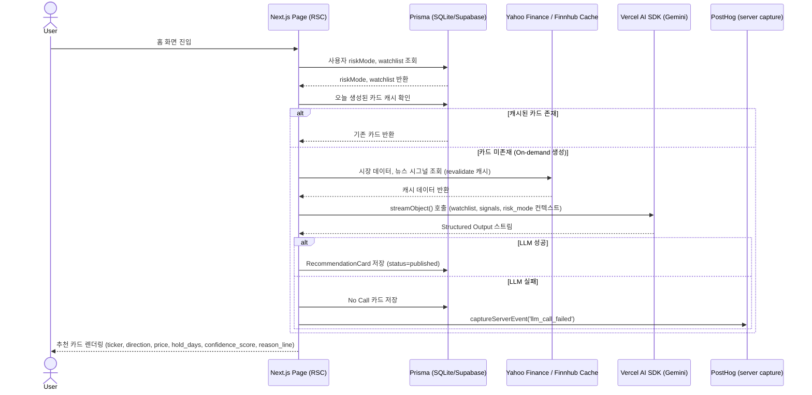
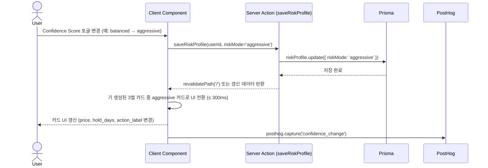
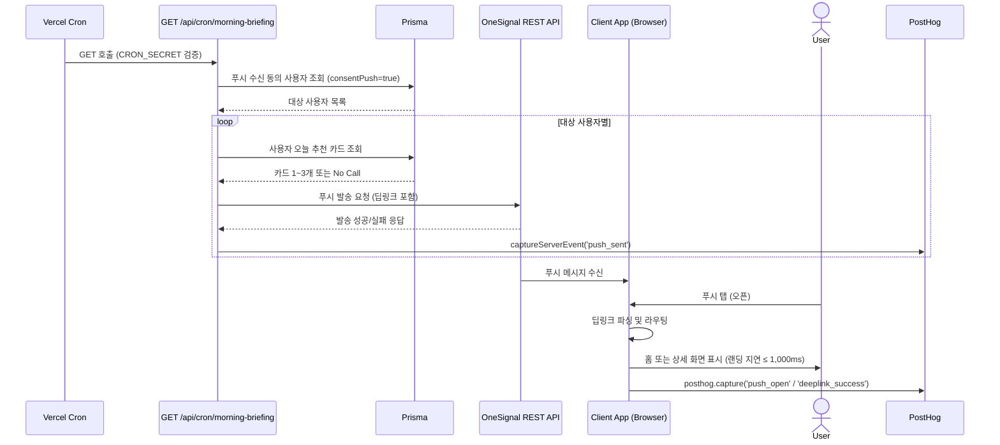
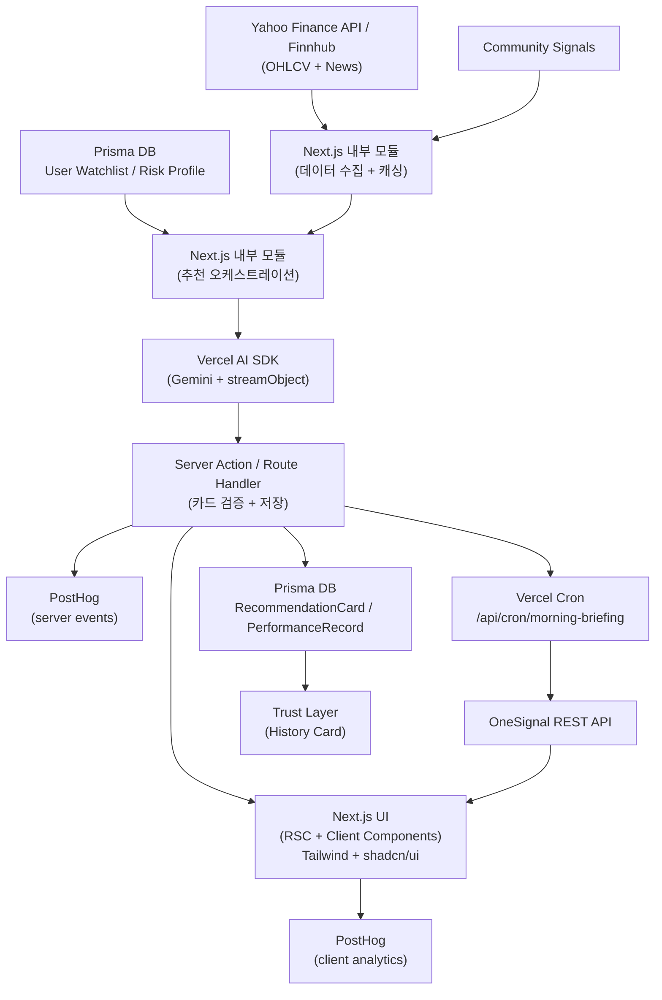
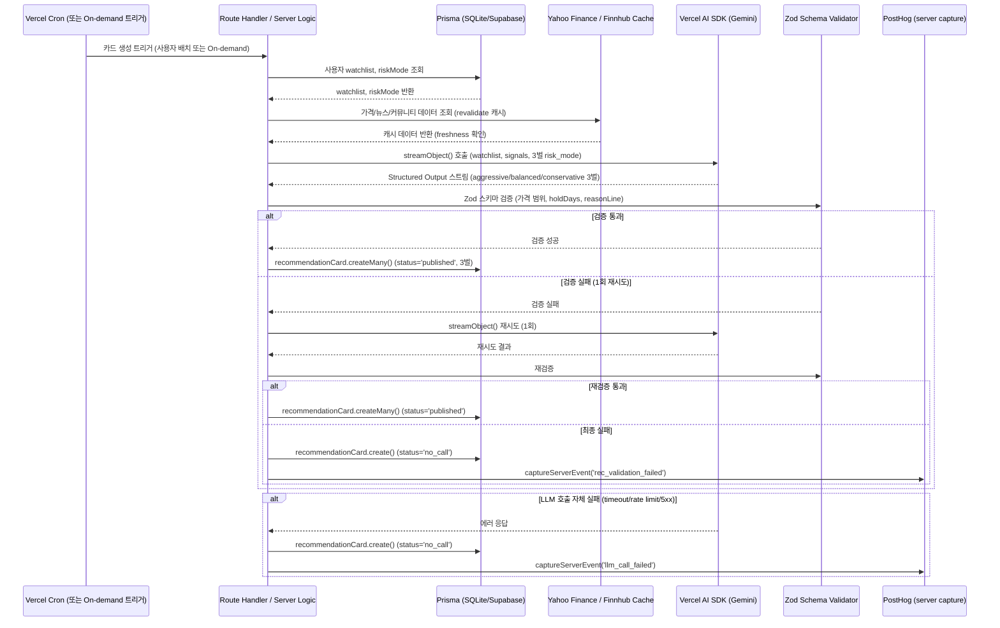
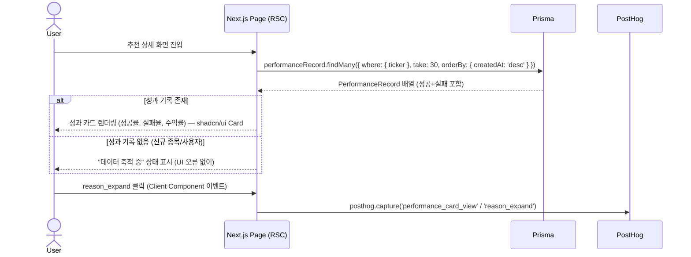
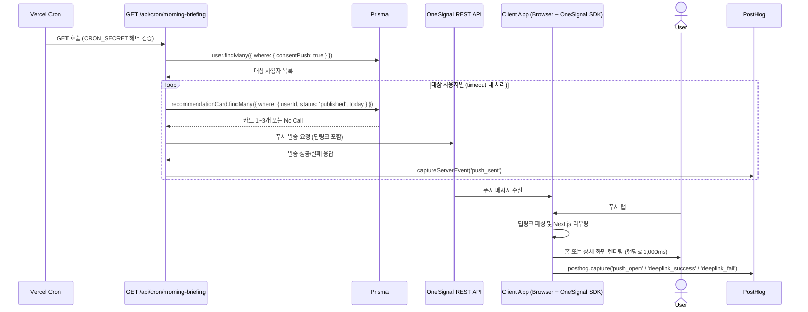
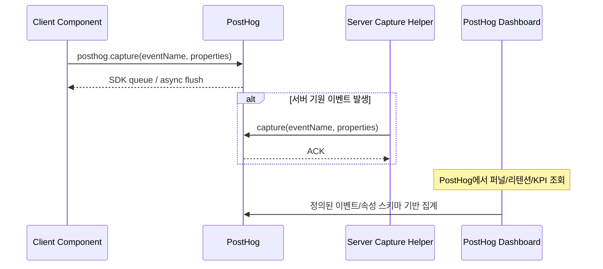

# Software Requirements Specification (SRS)

**Document ID:** SRS-001  
**Revision:** 0.3  
**Date:** 2026-04-16  
**Standard:** ISO/IEC/IEEE 29148:2018  
**Status:** Draft  
**Project:** 미국주식 리스크-맞춤 의사결정 인터페이스 (US Stock Risk-Adaptive Decision Interface)  
**Source PRD:** `us_stock_decision_interface_prd_v1_0.md` (v1.0, 2026-04-14)

---

## 개정 이력 (Revision History)

| 버전 | 날짜 | 작성자 | 변경 내용 |
|---|---|---|---|
| 0.1 | 2026-04-15 | Requirements Engineering (AI) | 최초 작성 — PRD v1.0 기반 |
| 0.2 | 2026-04-16 | Requirements Engineering (AI) | C-TEC-001~007 기술 스택 정합성 전면 반영 (PLAN-SRS-002), F9 LLM 카드 생성·F10 인증 요구사항 추가, API/데이터 모델/아키텍처 다이어그램 전면 재작성 |
| 0.3 | 2026-04-16 | Requirements Engineering (AI) | SaaS/API 구체화 및 바이브코딩 최적화 반영 (PLAN-SRS-003), OneSignal/PostHog/Yahoo Finance·Finnhub 명시, `/api/events`·NotificationLog·EventLog 제거, `streamObject()` 강제 반영 |

---

## 목차 (Table of Contents)

1. Introduction  
   1.1 Purpose  
   1.2 Scope  
   1.3 Definitions, Acronyms, Abbreviations  
   1.4 References  
   1.5 Constraints and Assumptions  
2. Stakeholders  
3. System Context and Interfaces  
   3.1 External Systems  
   3.2 Client Applications  
   3.3 API Overview  
   3.4 Interaction Sequences  
4. Specific Requirements  
   4.1 Functional Requirements  
   4.2 Non-Functional Requirements  
5. Traceability Matrix  
6. Appendix  
   6.1 API Endpoint & Server Action List  
   6.2 Entity & Data Model (Prisma 호환)  
   6.3 Detailed Interaction Models  

---

## 1. Introduction

### 1.1 Purpose

본 SRS는 **미국주식 리스크-맞춤 의사결정 인터페이스** (이하 "시스템")의 소프트웨어 요구사항을 ISO/IEC/IEEE 29148:2018 표준에 따라 명세한 문서이다.

시스템이 해결하려는 핵심 문제는 다음과 같다:

> "정보를 많이 읽고 차트를 오래 봐도, 바쁜 직장인 투자자가 결국 실행 가능한 숫자와 확신을 얻지 못한다."

본 SRS는 다음을 포함한다:
- 기능 요구사항 (Functional Requirements)
- 비기능 요구사항 (Non-Functional Requirements)
- 시스템 인터페이스 정의
- 데이터 모델 (Prisma ORM 호환)
- 추적성 매트릭스 (Traceability Matrix)
- 추천 카드 생성, 리스크 성향 설정, 성과 이력 조회, 푸시 알림 발송 등 핵심 흐름의 시퀀스 다이어그램

본 문서의 독자는 개발팀, QA팀, PM, 보안팀, 법무팀, 데이터 엔지니어링팀이다.

---

### 1.2 Scope

#### 1.2.1 In-Scope (v1.0)

| 범위 항목 | 설명 |
|---|---|
| 관심 종목/섹터 기반 온보딩 | 사용자가 최소 1개, 권장 최대 3개의 관심 종목 또는 섹터를 등록하고 수정할 수 있다 |
| 오늘의 추천 카드 (1~3개) | 종목명(ticker), 방향(direction), 가격(entry/target), 기간(hold_days), 신뢰도(confidence_score), 한 줄 이유(reason_line) 포함 카드 제공 |
| 매수/매도 가격 및 보유 기간 제안 | 진입가 또는 진입 범위, 청산가 또는 청산 범위, 1~10일 정수 horizon |
| Confidence Score 선택 UI | 공격형/중립형/안정형 3단계, 선택 시 카드 출력값 동적 반영 |
| 최근 예측 기록 / 성과 카드 | 최근 30건 또는 30일, 성공·실패 모두 포함 |
| 한 줄 이유 설명 | 160자 이하 비어 있지 않은 문자열, 카드 1장당 1개 원칙 |
| 아침 브리핑 푸시 알림 | 하루 1회 핵심 추천 알림, 딥링크 포함 |
| 리스크 프로필 저장 및 복원 | 세션 간 risk_mode 유지 |
| 행동 이벤트 추적 | 추천 카드 노출·클릭·저장·알림 설정·브로커 이동·가격 복사 등 사용자 행동 이벤트를 PostHog에 수집 |
| 제품 분석 대시보드 | PostHog 기반으로 ADR, CTR, 리텐션 등 핵심 지표를 조회 |
| LLM 기반 추천 카드 생성 | Vercel AI SDK + Google Gemini API를 통한 Structured Output 기반 카드 생성 |
| 사용자 인증 | NextAuth.js 기반 소셜/이메일 로그인, 세션 관리 |

#### 1.2.2 Out-of-Scope (v1.0)

| 배제 항목 | 배제 근거 |
|---|---|
| 자동 주문 실행 (브로커 계좌 직접 연동) | ADR-001/003: MVP JTBD 검증 이전 |
| 실시간 틱(tick) 단위 시그널 | ADR-003: 3~5일 Horizon 고정 정책 |
| 커뮤니티/UGC (전략 공유, 토론) | ADR-001/004: 복잡도 증가, 신뢰 리스크 |
| 심층 포트폴리오 최적화 | MVP 범위 초과 |
| 장문의 Explainable AI 대시보드 | ADR-004: 차트/지표 배제 원칙 |
| 전문가 콘텐츠 / 리딩방 기능 | ADR-001과 충돌 |
| 캔들 차트, RSI, MACD 등 원본 차트 위젯 노출 | ADR-004 |
| 별도 백엔드 서버 (Python/Express 등) | C-TEC-001/002: Next.js 단일 풀스택 정책 |
| 별도 메시지 큐 (Kafka, SQS 등) | MVP 200명 규모에 과도한 인프라 |

---

### 1.3 Definitions, Acronyms, Abbreviations

| 용어 | 정의 |
|---|---|
| **ADR (Actionable Decision Rate)** | 24시간 내 actionable_event 발생 사용자 수 / rec_card_view 사용자 수. 북극성 KPI(NS-01). |
| **actionable_event** | 다음 중 1개 이상 발생: bookmark_add, alert_set, broker_redirect, price_copy, execution_intent_submit |
| **App Router** | Next.js 13+ 기반의 라우팅 시스템. React Server Components(RSC)와 Server Actions를 지원한다. |
| **Confidence Score** | 사용자가 직접 선택하는 리스크 성향 단계. 공격형(aggressive) / 중립형(balanced) / 안정형(conservative) 3단계. |
| **Decision Layer** | 정보 제공이 아닌, 실행 가능한 의사결정 카드를 출력하는 제품 레이어(ADR-001). |
| **Direction** | 추천 카드의 매매 방향. BUY 또는 SELL. |
| **Hold Days** | 추천 보유 기간. 1~10일 정수값. |
| **No Call** | 입력 데이터 부족 또는 LLM 호출 실패로 추천 카드를 생성하지 못하는 상태. 상태 카드 1장 또는 안내 문구로 대체. |
| **Performance Record** | 과거 추천에 대한 실제 수익률 및 적중 여부를 포함한 이력 데이터. |
| **Prisma** | Node.js/TypeScript용 ORM. 스키마 정의, 마이그레이션, 타입 안전 쿼리를 지원한다. |
| **PostHog** | 제품 분석 플랫폼. 클라이언트/서버 이벤트 수집, 퍼널·리텐션·대시보드를 제공한다. |
| **posthog-js** | 브라우저에서 직접 PostHog로 이벤트를 전송하는 JavaScript SDK. |
| **OneSignal** | 관리형 웹 푸시 알림 서비스. REST API, 웹 SDK, 발송/오픈 대시보드를 제공한다. |
| **PRD** | Product Requirements Document. 본 SRS의 Source of Truth. |
| **Reason Line** | 추천 카드에 포함되는 1문장 이유 설명. 최대 160자. |
| **Recommendation Card** | 시스템의 핵심 출력 단위. ticker, direction, entry_price, target_price, hold_days, confidence_score, reason_line으로 구성. |
| **Risk Mode** | 사용자 선택 리스크 성향 값. aggressive / balanced / conservative 중 하나. |
| **Route Handler** | Next.js App Router에서 HTTP 요청을 처리하는 서버 측 핸들러. `app/api/**/route.ts` 파일로 정의한다. |
| **RSC (React Server Component)** | 서버에서만 실행되는 React 컴포넌트. DB 직접 접근, 비동기 데이터 로딩을 지원한다. |
| **Server Action** | Next.js에서 `'use server'` 지시자로 정의하는 서버 측 함수. 클라이언트에서 직접 호출 가능하다. |
| **shadcn/ui** | Tailwind CSS 기반의 재사용 가능한 UI 컴포넌트 라이브러리. 복사-붙여넣기 방식으로 프로젝트에 통합한다. |
| **SLA** | Service Level Agreement. 서비스 가용성 보장 수준. |
| **SRS** | Software Requirements Specification. 본 문서. |
| **Structured Output** | LLM이 사전 정의된 JSON Schema에 맞춰 출력을 생성하는 기법. v0.3에서는 Vercel AI SDK의 `streamObject()`를 기본 구현 방식으로 사용한다. |
| **Trust Layer** | 실패를 포함한 예측 성과 기록을 공개하여 신뢰를 형성하는 제품 레이어(ADR-005). |
| **Vercel AI SDK** | Vercel에서 제공하는 AI 통합 SDK. LLM 호출, 스트리밍, Structured Output 등을 표준 인터페이스로 지원한다. |
| **Yahoo Finance API** | 주가·종목 정보 조회에 사용하는 외부 데이터 소스. |
| **Finnhub** | 무료 티어로 시장 데이터 및 뉴스 데이터를 제공하는 외부 API. |
| **`streamObject()`** | Vercel AI SDK의 구조화된 스트리밍 출력 함수. 서버 타임아웃 회피와 점진적 응답 전달에 사용한다. |
| **Vercel Cron** | Vercel 플랫폼의 스케줄링 기능. `vercel.json`에 cron 표현식으로 정의하며, 지정 시각에 Route Handler를 호출한다. |
| **Watchlist** | 사용자가 등록한 관심 종목 및 섹터 목록. |
| **AOS** | Adjusted Opportunity Score. JTBD 탐색 과정에서 도출된 기회 점수. |
| **JTBD** | Jobs to be Done. 사용자가 제품을 통해 완수하려는 과업. |
| **KPI** | Key Performance Indicator. |
| **MoSCoW** | Must / Should / Could / Won't 우선순위 분류 체계. |
| **NFR** | Non-Functional Requirement. |
| **p95** | 95번째 백분위수 응답 시간. |
| **RBAC** | Role-Based Access Control. |
| **RPO** | Recovery Point Objective. 장애 발생 시 허용 가능한 데이터 유실 시점. |
| **RTO** | Recovery Time Objective. 장애 발생 후 서비스 복구 목표 시간. |
| **RUM** | Real User Monitoring. 실제 사용자 브라우저/앱 성능 측정. |
| **TLS** | Transport Layer Security. |
| **UGC** | User-Generated Content. |
| **VPS** | Value Proposition & MVP Feature Map. 본 PRD의 상위 전략 문서. |

---

### 1.4 References

| REF ID | 문서명 | 버전 | 비고 |
|---|---|---|---|
| REF-01 | 미국주식 리스크-맞춤 의사결정 인터페이스 PRD | v1.0 (2026-04-14) | 본 SRS의 Source of Truth |
| REF-02 | Value Proposition & MVP Feature Map | — | `value_proposition_mvp_feature_map.md` |
| REF-03 | Decision Layer Product ADR | v0.1 | `decision_layer_product_adr_v0_1.md` (ADR-001~005) |
| REF-04 | PostHog Product Analytics Dashboard Config | v0.3 (작성 예정) | `analytics/posthog_dashboard_v0.3` |
| REF-05 | Experiment Tracker | v0.2 (작성 예정) | `experiments/decision_layer_beta_v0.2` |
| REF-06 | ISO/IEC/IEEE 29148:2018 | 2018 | Systems and software engineering — Life cycle processes — Requirements engineering |
| REF-07 | 문제 정의 문서 | — | `5.problem_statements.md` |
| REF-08 | KSF 분석 문서 | — | `4.ksfs.md` |
| REF-09 | 가치사슬 분석 | — | `3.value_chain.md` |
| REF-10 | 경쟁사 분석 | — | `2.competitor_analysis_ai_stocks.md` |
| REF-11 | SRS v0.2 기술 스택 정합성 변경 계획서 | v1.0 (2026-04-16) | `plans/srs-v0.2-tech-stack-alignment-plan.md` (PLAN-SRS-002) |
| REF-12 | SRS v0.3 개정 계획서 (바이브코딩 및 시스템 효율성 최적화) | v1.0 (2026-04-16) | `srs_revision_recipe.md` (PLAN-SRS-003) |

---

### 1.5 Constraints and Assumptions

#### 1.5.1 제품/아키텍처 제약 (ADR 기반)

| 제약 ID | 출처 | 제약 내용 |
|---|---|---|
| CON-001 | ADR-001 | 시스템의 핵심 출력은 정보 요약이 아닌 실행 가능한 행동 카드(Recommendation Card)이어야 한다. |
| CON-002 | ADR-002 | Confidence Score는 공격형/중립형/안정형 3단계 선택형 UX로 구현하며, 단순 배지(badge)로 단순화해서는 안 된다. |
| CON-003 | ADR-003 | 추천 예측 범위(Horizon)는 3~5 영업일로 제한한다. 실시간 초단타 시그널은 v1.0에서 제공하지 않는다. |
| CON-004 | ADR-004 | 메인 폴드 영역에서 캔들 차트, RSI, MACD 등 원본 차트 위젯은 노출하지 않는다. |
| CON-005 | ADR-005 | 성과 기록은 실패를 포함하여 공개한다. 실패 기록을 비노출하는 설계는 예외 승인 없이 반영할 수 없다. |
| CON-006 | REF-01 §6.4 | v1.0에서는 브로커 주문 API와 직접 연동하지 않는다. |
| CON-007 | REF-01 §6.4 | 가격/뉴스/커뮤니티 데이터는 Next.js `fetch` 캐시(`revalidate`) 또는 `unstable_cache`를 통해 지연 허용 범위 내 캐시를 사용한다. |
| CON-008 | REF-01 §5.3 | 실제 브로커 계좌·주문 권한은 v1.0에서 저장하거나 연동하지 않는다. |

#### 1.5.2 기술 스택 제약

| 제약 ID | 출처 | 제약 내용 |
|---|---|---|
| C-TEC-001 | 기술 스택 정책 | 모든 서비스는 **Next.js (App Router)** 기반의 단일 풀스택 프레임워크로 구현한다. 프론트엔드와 백엔드를 별도 분리하지 않는다. |
| C-TEC-002 | 기술 스택 정책 | 서버 측 로직(DB 접근, API 호출 등)은 Next.js의 **Server Actions** 또는 **Route Handlers**를 사용하여 별도의 백엔드 서버 없이 구현한다. |
| C-TEC-003 | 기술 스택 정책 | 데이터베이스는 **Prisma ORM**을 사용하며, 로컬 개발환경은 **SQLite**, 배포 환경은 **Supabase(PostgreSQL)**를 사용하여 인프라 설정 복잡도를 최소화한다. |
| C-TEC-004 | 기술 스택 정책 | UI 및 스타일링은 **Tailwind CSS**와 **shadcn/ui**를 사용하여 일관된 디자인 코드를 생성하도록 강제한다. |
| C-TEC-005 | 기술 스택 정책 | LLM 오케스트레이션은 별도의 Python 서버 없이 **Vercel AI SDK**를 사용하여 Next.js 내부에서 직접 구현한다. |
| C-TEC-006 | 기술 스택 정책 | LLM 호출은 **Google Gemini API**를 기본으로 사용하며, 환경 변수(`GEMINI_MODEL`) 설정만으로 모델 교체가 가능하도록 SDK의 표준 인터페이스를 준수한다. |
| C-TEC-007 | 기술 스택 정책 | 배포 및 인프라 관리는 **Vercel 플랫폼**으로 단일화하며, CI/CD 설정 없이 **Git Push만으로 배포를 자동화**한다. |

#### 1.5.3 보안 제약

| 제약 ID | 제약 내용 |
|---|---|
| CON-009 | 모든 외부 및 내부 API는 TLS를 강제 적용한다. |
| CON-010 | API 키와 토큰은 **Vercel Environment Variables**에 보관하며, 코드 또는 로그에 평문으로 기록하지 않는다. |
| CON-011 | 사용자 식별자와 이벤트 저장소는 저장 시 암호화를 적용한다. |
| CON-012 | 운영/분석 콘솔은 RBAC를 적용하며 프로덕션 쓰기 권한은 최소 2인 이하로 제한한다. |

#### 1.5.4 가정 (Assumptions)

| 가정 ID | 가정 내용 |
|---|---|
| ASS-001 | 사용자는 장문의 리서치보다 요약된 실행 카드를 더 선호한다. |
| ASS-002 | 1~3개의 추천 카드가 5개 이상의 추천보다 전환율이 높다. |
| ASS-003 | 리스크 성향 조작 경험이 신뢰와 재방문에 긍정적 영향을 준다. |
| ASS-004 | 실패 이력을 포함해도 오히려 신뢰 형성에 도움이 된다. |
| ASS-005 | 베타 참여자 200명은 기존 미국주식 투자 관심 사용자이다. |
| ASS-006 | 기본 시장/뉴스 데이터 소스는 **Yahoo Finance API 또는 Finnhub 무료 티어**이며, Next.js `fetch` 캐시(`revalidate`) 또는 `unstable_cache`를 통해 지연 허용형으로 공급된다. |
| ASS-007 | 푸시 발송은 **OneSignal REST API + 관리형 Web SDK**를 사용하며, 커스텀 Service Worker 구현 없이 Vercel 호스팅 환경에서 동작한다. |
| ASS-008 | 사용자 인증은 **NextAuth.js** 기반 Google/Kakao OAuth 또는 이메일 로그인 방식으로 제공된다. |
| ASS-009 | Vercel **Hobby Plan** 기준으로 MVP를 운영하며, 필요 시 Pro Plan으로 전환한다. |
| ASS-010 | SQLite(로컬)와 PostgreSQL(Supabase) 간 **Prisma 스키마 호환성이 유지**된다. |
| ASS-011 | 제품 행동 이벤트와 KPI 조회는 **PostHog**를 기본 분석 저장소 및 대시보드로 사용한다. |

---

## 2. Stakeholders

| 역할 (Role) | 대표 페르소나 | 책임 (Responsibility) | 관심사 (Interest) |
|---|---|---|---|
| **바쁜 직장인 서학개미** | 한국 거주, 미국장 실시간 대응 어려움, 예약주문 사용 | 아침 브리핑 활용, 관심 종목 등록, 추천 카드 기반 주문 준비 | 탐색 시간 단축, 아침 브리핑, 예약주문 가능 숫자 |
| **준경험 투자자** | 뉴스/유튜브 시청, 차트 해석 미숙 | 추천 카드 열람, 방향·가격·기간 확인, Confidence Score 조작 | 차트 없이 결과 이해, 가격·기간 명시 |
| **불신형 유료 독자** | 리딩방/유튜버 경험, 맹신 거부 | 성과 이력 열람, 실패 기록 확인, 한 줄 이유 확인 | 성과 이력 공개, 실패 기록 포함, 확률·이유 |
| **Product Manager** | — | PRD 관리, KPI 목표 설정, 범위 조정 | NS-01 ADR 달성, 실험 결과 |
| **Fullstack Developer** | — | Next.js 앱 구현, Prisma 스키마 관리, Vercel AI SDK 통합, Server Action/Route Handler 개발 | API p95 준수, LLM 호출 안정성, Prisma 쿼리 성능 |
| **Data / Analytics Owner** | — | PostHog 이벤트 taxonomy 관리, 지표 정의, 데이터 품질 확인 | 데이터 freshness, 누락률, 이벤트 명세 일관성 |
| **QA Engineer** | — | AC 기반 테스트, 회귀 테스트, 스키마 검증 | AC 100% 충족 |
| **Security Officer** | — | 보안 정책 시행, 권한 감사, 취약점 대응 | TLS, RBAC, 감사 로그 |
| **Legal / Compliance** | — | 투자 자문 오해 방지 문구 검토 | 법무 문구, 책임 제한 |
| **Marketing / Growth** | — | 푸시 알림 채널 운영, 베타 채널 관리 | 푸시 오픈율, 딥링크 성공률 |

---

## 3. System Context and Interfaces

### 3.1 External Systems

| 외부 시스템 | 유형 | 제공 데이터 | 연동 방식 | 제약 |
|---|---|---|---|---|
| **Yahoo Finance API / Finnhub** | **외부 데이터 소스** | **OHLCV, 종목 메타데이터, 종목/섹터 관련 뉴스** | **REST + Next.js `fetch` 캐시** | **무료 티어 rate limit 준수, 10분 이상 지연 시 경보, 프롬프트 입력 JSON 스키마 고정 필요** |
| Community Signal Provider | 외부 데이터 소스 | 소셜/커뮤니티 시그널 점수 | REST + Next.js `fetch` 캐시 | 지연 허용형 캐시 |
| **Google Gemini API** | **LLM 서비스** | **추천 카드 Structured Output (JSON)** | **Vercel AI SDK (`@ai-sdk/google`) + `streamObject()`** | **Rate limit 준수, Serverless Function timeout 내 처리, `GEMINI_MODEL` 환경 변수로 모델 교체** |
| **Supabase** | **DB 인프라 (배포)** | **PostgreSQL 호스팅, Connection Pooling** | **Prisma ORM (`@prisma/client`)** | **로컬 SQLite와 Prisma 스키마 동일, 마이그레이션은 `prisma migrate`** |
| **OneSignal** | **푸시 알림 서비스** | **웹 푸시 발송, 발송/오픈 현황 대시보드, 구독 관리** | **REST API + Web SDK** | **발송 성공률 ≥ 99%, 발송 예약 시각 대비 5분 이내, 커스텀 Service Worker 직접 구현 금지** |
| **PostHog** | **제품 분석 플랫폼** | **행동 이벤트 수집, 퍼널/리텐션/KPI 대시보드** | **`posthog-js` + 필요 시 서버 측 capture helper** | **핵심 제품 이벤트 누락률 < 1%, 별도 `/api/events` 구현 금지** |
| **NextAuth.js** | **인증 라이브러리** | **소셜/이메일 로그인, JWT 세션 관리** | **Next.js App Router 내장 (`next-auth`)** | **OAuth Provider(Google, Kakao), JWT 기반 세션** |
| **Vercel Platform** | **배포/런타임 인프라** | **Serverless Functions, Cron Jobs, Edge Runtime, CDN** | **Git Push 자동 배포** | **Hobby: 함수 10s timeout, Cron 1일 1회 / Pro: 60s timeout, Cron 1시간 1회** |

### 3.2 Client Applications

| 클라이언트 | 플랫폼 | 통신 방식 | 비고 |
|---|---|---|---|
| Web App (Next.js) | PC/모바일 브라우저 | Server Components (RSC), Server Actions, Route Handlers, `posthog-js`, OneSignal Web SDK | 추천 카드, Confidence Score UI, 성과 카드. Tailwind CSS + shadcn/ui |
| Mobile Web | 모바일 브라우저 | 동일 Next.js 앱 (반응형) + OneSignal Web SDK | 아침 브리핑 푸시 수신, 딥링크 랜딩, 제품 이벤트 추적 |

### 3.3 API Overview

| 엔드포인트 / 액션 | 메서드/유형 | 구현 방식 | 설명 | SLA |
|---|---|---|---|---|
| `/api/recommendations/today` | GET | Route Handler | 오늘의 추천 카드 1~3개 조회 (또는 Server Component 직접 Prisma 호출) | p95 ≤ 800ms |
| `/api/recommendations/[recId]` | GET | Route Handler | 추천 상세 (이유, 성과, 유사 패턴) 조회 | p95 ≤ 700ms (렌더) |
| `saveRiskProfile()` | — | **Server Action** | 리스크 성향 저장 (`'use server'` 함수) | ≤ 1,000ms 반영 |
| `saveWatchlist()` | — | **Server Action** | 관심 종목 등록/수정 (`'use server'` 함수) | — |
| `posthog.capture()` | SDK Call | **Client SDK (`posthog-js`)** | 행동 이벤트 직접 전송 (추천 카드 노출·클릭·복사·브로커 이동 등) | 누락률 < 1% |
| `captureServerEvent()` | Internal Helper | **서버 측 PostHog capture helper** | `llm_call_failed`, `rec_validation_failed`, `push_sent` 등 서버 기원 이벤트 기록 | 누락률 < 1% |
| `/api/cron/morning-briefing` | GET | **Vercel Cron** | 아침 브리핑 배치 실행 후 OneSignal REST API 호출 | 예약 대비 5분 이내 |
| `/api/admin/health` | GET | Route Handler | Yahoo Finance/Finnhub 데이터 freshness 및 결측률 확인 (운영용) | — |
| `/api/auth/[...nextauth]` | GET/POST | **NextAuth.js** Route | 로그인/로그아웃/세션 관리 | — |

### 3.4 Interaction Sequences (핵심 시퀀스 다이어그램)

#### 3.4.1 추천 카드 조회 핵심 흐름

#### 3.4.2 Confidence Score 변경 흐름

#### 3.4.3 아침 브리핑 푸시 발송 흐름

---

## 4. Specific Requirements

### 4.1 Functional Requirements

> - **형식:** REQ-FUNC-xxx  
> - **Source:** 매핑된 User Story 및 PRD 섹션  
> - **Priority:** MoSCoW (M=Must, S=Should, C=Could, W=Won't)  
> - **AC:** Given/When/Then 형식의 인수 기준  

---

#### F1. 관심 종목/섹터 온보딩

| REQ ID | 요구사항 설명 | Priority | Source | Acceptance Criteria |
|---|---|---|---|---|
| REQ-FUNC-001 | 시스템은 사용자가 관심 종목 또는 섹터를 최소 1개, 최대 3개까지 등록할 수 있도록 온보딩 UI를 제공해야 한다. UI는 shadcn/ui 컴포넌트를 사용한다. | M | PRD §4.1 Must | **Given** 신규 사용자가 온보딩 화면에 진입했을 때 **When** 관심 종목/섹터를 1개 선택하면 **Then** Server Action `saveWatchlist()`가 호출되어 watchlist에 해당 항목을 저장하고 홈으로 이동해야 한다. |
| REQ-FUNC-002 | 시스템은 온보딩 중 관심 종목/섹터를 3개 초과 선택 시도 시, 추가 선택을 차단하고 사용자에게 명시적 안내 메시지를 표시해야 한다. | M | PRD §4.1 Must | **Given** 사용자가 이미 3개를 선택한 상태에서 **When** 추가 항목을 선택 시도하면 **Then** 시스템은 선택을 차단하고 "최대 3개까지 선택 가능합니다" 안내를 표시해야 한다. |
| REQ-FUNC-003 | 시스템은 온보딩 이후에도 사용자가 관심 종목/섹터를 수정할 수 있는 UI를 제공해야 한다. | M | PRD §4.1 Must | **Given** 기존 관심 종목이 등록된 사용자가 **When** 설정 화면에서 종목을 변경하면 **Then** Server Action으로 watchlist가 갱신되며, 다음 추천 카드 생성 시 변경된 watchlist가 반영되어야 한다. |

---

#### F2. 오늘의 추천 카드 생성 및 노출

| REQ ID | 요구사항 설명 | Priority | Source | Acceptance Criteria |
|---|---|---|---|---|
| REQ-FUNC-010 | 시스템은 홈 화면 진입 시 추천 카드를 최대 3개 이하로 반환해야 한다. Server Component에서 Prisma를 통해 캐시된 카드를 조회하거나, On-demand로 LLM을 호출하여 생성한다. | M | Story 1, PRD §4.1 Must | **Given** 사용자가 관심 종목을 1개 이상 저장했고 **When** 홈 화면에 진입하면 **Then** 추천 카드가 3개 이하로 반환되며, 응답 p95는 800ms 이하이어야 한다. |
| REQ-FUNC-011 | 추천 카드의 각 항목에는 `ticker`, `direction`, `confidenceScore` 필드가 100% 포함되어야 한다. | M | Story 1 AC1-3, PRD §4.1 Must | **Given** 추천 카드가 생성되었고 **When** 홈 UI에 렌더링되면 **Then** 카드 1장당 ticker, direction, confidenceScore 필드는 null 또는 빈 값이 없어야 한다. |
| REQ-FUNC-012 | 추천 카드에는 `direction`, `entryPrice 또는 entryRange`, `holdDays`, `confidenceScore`, `reasonLine`이 모두 표시되어야 한다. | M | Story 2 AC2-1, PRD §4.1 Must | **Given** 카드가 정상 생성되었고 **When** 사용자가 추천 카드를 보면 **Then** direction, entryPrice 또는 entryRange, holdDays, confidenceScore, reasonLine 5개 필드가 모두 표시되어야 한다. |
| REQ-FUNC-013 | 데이터 부족 또는 LLM 호출 실패로 추천 카드를 생성할 수 없는 경우, 시스템은 빈 카드 대신 No Call 상태 카드 또는 안내 문구를 반환해야 하며 HTTP 5xx를 발생시키지 않아야 한다. | M | Story 1 AC1-2 | **Given** 가격/뉴스 입력이 최소 생성 조건을 만족하지 못했거나 LLM 호출이 실패했고 **When** 추천 카드 생성을 시도하면 **Then** 시스템은 No Call 상태 카드 1장 또는 대체 안내 문구를 반환하며 HTTP 5xx를 발생시키지 않아야 한다. |
| REQ-FUNC-014 | 메인 폴드 영역에는 캔들 차트, RSI, MACD 등 원본 차트 위젯이 노출되지 않아야 한다. | M | Story 2 AC2-3, ADR-004 | **Given** v1.0 범위에서 상세 화면이 열렸고 **When** 사용자가 추천 상세를 확인하면 **Then** 메인 폴드 영역에 캔들 차트, RSI, MACD 위젯이 렌더링되지 않아야 한다. (디자인 QA 체크리스트, 시각 회귀 테스트로 확인) |

---

#### F3. 가격 및 보유 기간 제안

| REQ ID | 요구사항 설명 | Priority | Source | Acceptance Criteria |
|---|---|---|---|---|
| REQ-FUNC-020 | 추천 카드는 `entryPrice`와 `targetPrice` 또는 `entryRangeLow/High`와 `targetRangeLow/High` 중 하나를 반드시 포함해야 하며, `holdDays`는 1~10의 정수값이어야 한다. | M | Story 3 AC3-1, PRD §4.1 Must | **Given** 추천 카드가 생성되었고 **When** 사용자에게 노출되면 **Then** entryPrice+targetPrice 또는 entryRange+targetRange 중 하나가 반드시 있고, holdDays는 1~10 정수이어야 한다. |
| REQ-FUNC-021 | 가격 산출값이 0 이하이거나 비정상 급등락 범위로 판정된 카드는 게시되지 않아야 하며, `rec_validation_failed` 이벤트가 기록되어야 한다. | M | Story 3 AC3-2 | **Given** LLM 출력 또는 입력 데이터 이상으로 가격이 0 이하 또는 비정상 범위로 산출되었고 **When** 카드 게시 전 Zod 스키마 검증을 수행하면 **Then** 해당 카드는 게시되지 않고 rec_validation_failed 이벤트가 PostHog server-side capture helper를 통해 기록되어야 한다. |
| REQ-FUNC-022 | 사용자가 가격 복사(price_copy) 버튼을 누르면 해당 가격 문자열이 클립보드에 복사되며, PostHog 이벤트가 기록되어야 한다. | M | Story 3 AC3-3 | **Given** 사용자가 가격 복사 버튼을 눌렀고 **When** 시스템이 요청을 처리하면 **Then** 클릭 후 응답 시간은 1초 이하이고, price_copy 이벤트 누락률은 1% 미만이어야 한다. |
| REQ-FUNC-023 | 사용자가 브로커 이동(broker_redirect) 버튼을 누르면 지정된 브로커 앱/웹으로 이동하며, PostHog 이벤트가 기록되어야 한다. | M | Story 3 AC3-3 | **Given** 사용자가 브로커 이동 버튼을 눌렀고 **When** 시스템이 요청을 처리하면 **Then** 클릭 후 응답 시간은 1초 이하이고, broker_redirect 이벤트 누락률은 1% 미만이어야 한다. |

---

#### F4. Confidence Score 선택 UI

| REQ ID | 요구사항 설명 | Priority | Source | Acceptance Criteria |
|---|---|---|---|---|
| REQ-FUNC-030 | 시스템은 공격형(aggressive) / 중립형(balanced) / 안정형(conservative) 3단계 이상의 Confidence Score 선택 UI를 shadcn/ui 컴포넌트로 제공해야 한다. | M | Story 4, PRD §4.1 Must, ADR-002 | **Given** 사용자가 추천 카드 화면에 진입했고 **When** Confidence Score UI가 렌더링되면 **Then** 선택 가능한 옵션은 aggressive, balanced, conservative 3가지 이상 표시되어야 한다. |
| REQ-FUNC-031 | Confidence Score 변경 시, `price`, `holdDays`, `actionLabel` 중 최소 1개 이상의 카드 출력값이 변경되고, UI 반영 시간은 300ms 이하이어야 한다. 이는 LLM 재호출 없이 기 생성된 risk_mode별 3벌 카드 중 해당 모드의 카드로 전환하는 방식으로 구현한다. | M | Story 4 AC4-1, ADR-002 | **Given** 사용자가 Confidence Score를 변경했고 **When** 카드 출력값이 갱신되면 **Then** price, holdDays, actionLabel 중 최소 1개가 변경되고 UI 반영 시간이 300ms 이하이어야 한다. |
| REQ-FUNC-032 | 사용자가 riskMode를 저장하면, 다음 세션 홈 재진입 시 저장된 값이 기본 선택값으로 복원되어야 한다. | S | Story 4 AC4-2, PRD §4.1 Should | **Given** 사용자가 Server Action `saveRiskProfile()`로 riskMode를 저장했고 **When** 다음 세션에서 홈에 재진입하면 **Then** Prisma에서 조회한 저장된 riskMode 값이 기본 선택값으로 복원되어야 한다. |
| REQ-FUNC-033 | Server Action에 허용되지 않은 riskMode 값이 전달된 경우, 서버는 Zod 검증 오류를 반환하며 기존 저장값을 변경하지 않아야 한다. | M | Story 4 AC4-3 | **Given** Server Action에 허용되지 않은 riskMode 값이 전달되었고 **When** 서버가 저장 요청을 받으면 **Then** Zod 검증 실패 → 오류 반환, 기존 저장값은 변경되지 않아야 한다. |

---

#### F5. 한 줄 이유 설명 및 성과 이력 (Trust Layer)

| REQ ID | 요구사항 설명 | Priority | Source | Acceptance Criteria |
|---|---|---|---|---|
| REQ-FUNC-040 | 추천 카드가 게시 상태일 때, `reasonLine`은 160자 이하의 비어 있지 않은 문자열이어야 한다. | M | Story 5 AC5-1, PRD §4.1 Must, ADR-005 | **Given** 추천 카드가 게시 대상 상태이고 **When** 카드가 렌더링되면 **Then** reasonLine은 길이가 1 이상 160 이하인 문자열이어야 하며 null 또는 공백만으로 구성되어서는 안 된다. |
| REQ-FUNC-041 | 성과 기록 조회 시, 최근 30건 또는 최근 30일 이내 데이터를 반환하며, 성공·실패 결과가 모두 있는 경우 둘 다 표시해야 한다. Server Component에서 Prisma `performanceRecord.findMany()`로 직접 조회한다. | M | Story 5 AC5-2, ADR-005 | **Given** 사용자가 상세 화면에서 성과 기록을 요청했고 **When** 기록을 조회하면 **Then** 최근 30건 또는 30일 이내 데이터를 반환하며, 성공/실패 결과가 모두 존재할 경우 둘 다 표시되어야 한다. |
| REQ-FUNC-042 | 성과 기록이 부족한 경우(신규 사용자/신규 종목), 빈 표 대신 "데이터 축적 중" 상태를 표시해야 하며 UI 오류를 발생시키지 않아야 한다. | M | Story 5 AC5-3 | **Given** 성과 기록이 부족하고 **When** 성과 카드 영역을 열면 **Then** 시스템은 "데이터 축적 중" 상태를 표시하며, UI 오류를 발생시키지 않아야 한다. |
| REQ-FUNC-043 | 시스템은 유사 패턴 참고 기능(Could)으로, 과거 유사 시그널 요약을 추천 상세 화면에 제공할 수 있다. (v1.0 선택 구현) | C | PRD §4.1 Could | **Given** 유사 패턴 데이터가 존재하고 **When** 사용자가 추천 상세를 열면 **Then** 유사 패턴 요약이 표시되거나 해당 섹션이 조용히 숨겨져야 한다. |

---

#### F6. 아침 브리핑 푸시 알림

| REQ ID | 요구사항 설명 | Priority | Source | Acceptance Criteria |
|---|---|---|---|---|
| REQ-FUNC-050 | 시스템은 Vercel Cron(`/api/cron/morning-briefing`)을 통해 푸시 수신에 동의한 사용자에게 미국장 전 지정 발송 시간 기준 ±5분 이내로 브리핑 푸시를 발송해야 한다. 실제 발송은 **OneSignal REST API**를 통해 수행하며, Cron 핸들러는 `CRON_SECRET` 환경 변수로 인증한다. | S | Story 6 AC6-1, PRD §4.1 Should, REF-12 | **Given** 사용자가 푸시 수신에 동의했고 **When** Vercel Cron이 발송 시간에 핸들러를 호출하면 **Then** OneSignal REST API를 통해 푸시가 예약 시각 대비 5분 이내 발송되고 발송 성공률은 99% 이상이어야 한다. |
| REQ-FUNC-051 | 사용자가 푸시를 탭하면, 추천 카드가 있는 홈 화면 또는 지정된 상세 화면으로 딥링크가 동작해야 한다. 클라이언트는 `push_open`, `deeplink_success`, `deeplink_fail` 이벤트를 **PostHog**에 기록해야 한다. | S | Story 6 AC6-2, REF-12 | **Given** 사용자가 푸시를 열었고 **When** 앱 또는 웹으로 진입하면 **Then** 추천 카드 홈 또는 지정 상세 화면으로 이동해야 하며, 딥링크 실패율은 1% 미만이어야 한다. |
| REQ-FUNC-052 | 푸시 수신을 거부했거나 OS 권한을 회수한 사용자는 발송 대상에서 제외되어야 하며, 잘못 발송된 메시지 비율은 0%이어야 한다. 사용자 구독 상태는 OneSignal 구독 정보와 시스템의 `consentPush` 값을 함께 기준으로 판정한다. | M | Story 6 AC6-3, REF-12 | **Given** 사용자가 푸시 수신을 거부했거나 OS 권한을 회수했고 **When** Cron 배치를 실행하면 **Then** 해당 사용자는 발송 대상에서 제외되어야 하며, 잘못 발송된 메시지 비율은 0%이어야 한다. |

---

#### F7. 행동 이벤트 추적 및 제품 분석

| REQ ID | 요구사항 설명 | Priority | Source | Acceptance Criteria |
|---|---|---|---|---|
| REQ-FUNC-060 | 시스템은 다음 **클라이언트 행동 이벤트**를 `/api/events` 없이 **`posthog-js`**를 통해 **PostHog**로 직접 전송해야 한다: `home_view`, `rec_card_impression`, `rec_card_click`, `rec_detail_view`, `bookmark_add`, `alert_set`, `broker_redirect`, `price_copy`, `execution_intent_submit`, `confidence_view`, `confidence_change`, `performance_card_view`, `reason_expand`, `push_open`, `deeplink_success`, `deeplink_fail`. 서버 기원 이벤트(`rec_validation_failed`, `llm_call_failed`, `push_sent`)는 별도의 **server-side capture helper**로 PostHog에 기록해야 하며, Prisma `EventLog` 모델은 구현하지 않는다. | M | PRD §1.1, §1.2, §3.x, REF-12 | **Given** 사용자가 해당 행동을 수행했거나 서버 측 운영 이벤트가 발생했고 **When** 이벤트가 발행되면 **Then** 이벤트는 PostHog에 1% 미만 누락률로 기록되어야 하며 `/api/events` 엔드포인트는 구현되지 않아야 한다. |
| REQ-FUNC-061 | 시스템은 ADR, 카드 CTR, First Decision Time, Confidence Engagement Rate, D7/D30 Retention 등 핵심 KPI를 **PostHog 자체 대시보드**에서 조회 가능하도록 이벤트 taxonomy와 속성 스키마를 정의해야 한다. 별도 Prisma 집계 배치나 Vercel Cron 기반 KPI 대시보드 기능은 v0.3 범위에 포함하지 않는다. | S | PRD §1.2, §5.4, REF-12 | **Given** PM 또는 분석 담당자가 KPI를 확인하려 하고 **When** 정의된 이벤트가 충분히 수집되면 **Then** PostHog 대시보드에서 핵심 지표를 조회할 수 있어야 하며, 별도 내부 KPI 집계 배치 기능은 구현되지 않아야 한다. |

---

#### F8. 추천 이력 아카이브

| REQ ID | 요구사항 설명 | Priority | Source | Acceptance Criteria |
|---|---|---|---|---|
| REQ-FUNC-070 | 시스템은 종목별 과거 추천 결과 목록을 조회할 수 있는 UI를 제공해야 한다. Server Component에서 Prisma를 통해 직접 조회한다. | S | PRD §4.1 Should | **Given** 사용자가 특정 ticker의 추천 이력을 조회하면 **When** Server Component가 Prisma 쿼리를 실행하면 **Then** 해당 ticker의 추천 결과(hitFlag, realizedReturn 포함)가 최신순으로 반환되어야 한다. |

---

#### F9. LLM 기반 추천 카드 생성

| REQ ID | 요구사항 설명 | Priority | Source | Acceptance Criteria |
|---|---|---|---|---|
| REQ-FUNC-080 | 시스템은 **Vercel AI SDK**(`@ai-sdk/google`)를 통해 **Google Gemini API**를 호출하여 추천 카드를 생성해야 한다. LLM 호출은 Next.js Server Action 또는 Route Handler 내에서 이루어지며, **`streamObject()`**를 기본 구현 방식으로 사용해야 한다. | M | C-TEC-005, C-TEC-006 | **Given** 사용자 watchlist와 시장 데이터가 준비되었고 **When** LLM 호출이 실행되면 **Then** Gemini API가 호출되고 RecommendationCard 스키마를 준수하는 JSON이 반환되어야 한다. |
| REQ-FUNC-081 | LLM 출력은 **Structured Output** (`streamObject()`) 형식으로 강제되어야 하며, 카드 스키마(`ticker`, `direction`, `entryPrice`, `targetPrice`, `holdDays`, `confidenceScore`, `reasonLine`)에 100% 적합해야 한다. 스키마 불일치 시 1회 재시도하고, 실패 시 No Call 상태로 처리한다. | M | C-TEC-005, F2 | **Given** LLM 호출 결과가 반환되었고 **When** Zod 스키마 검증을 수행하면 **Then** 모든 필수 필드가 존재하고 타입이 일치해야 한다. 불일치 시 1회 재시도 후에도 실패하면 No Call 카드를 생성한다. |
| REQ-FUNC-082 | LLM 프롬프트에는 **사용자 watchlist, 시장 데이터 요약(OHLCV), 뉴스 시그널, risk_mode**가 컨텍스트로 포함되어야 한다. risk_mode별로 3벌 카드(aggressive/balanced/conservative)를 한 번에 생성하여, Confidence Score 변경 시 LLM 재호출 없이 即시 전환이 가능하도록 한다. | M | F4 REQ-FUNC-031 | **Given** LLM 호출 시 **When** 프롬프트를 구성하면 **Then** watchlist, OHLCV 요약, 뉴스 시그널, risk_mode 4종 데이터가 포함되어야 하며, 3벌 카드가 한 번의 호출로 생성되어야 한다. 기본 시장/뉴스 소스는 Yahoo Finance API 또는 Finnhub를 사용한다. |
| REQ-FUNC-083 | LLM 호출 실패(API 에러, timeout, rate limit) 시 시스템은 **No Call 상태 카드**를 반환하고 `llm_call_failed` 이벤트를 PostHog server-side capture helper를 통해 기록해야 한다. 사용자에게 에러 페이지가 노출되어서는 안 된다. | M | F2 REQ-FUNC-013 | **Given** Gemini API 호출이 5xx/timeout/rate limit으로 실패했고 **When** 에러 핸들링이 실행되면 **Then** No Call 카드가 반환되고 llm_call_failed 이벤트가 PostHog server-side capture helper를 통해 기록되며, 사용자에게는 안내 문구만 표시되어야 한다. |
| REQ-FUNC-084 | `GEMINI_MODEL` **환경 변수** 변경만으로 LLM 모델을 교체할 수 있어야 하며, Vercel AI SDK의 표준 인터페이스를 사용하여 출력 스키마 호환성이 유지되어야 한다. | S | C-TEC-006 | **Given** GEMINI_MODEL 환경 변수를 변경하고 **When** Vercel에 재배포하면 **Then** 동일한 Structured Output 스키마로 카드가 생성되어야 한다. |
| REQ-FUNC-085 | 시스템 프롬프트에 **"투자 참고용 정보이며 투자 자문이 아님"** 면책 조항이 포함되어야 한다. 카드 UI 하단에도 고정 면책 문구가 항시 표시되어야 한다. | M | CON-006, Legal | **Given** 추천 카드가 렌더링될 때 **When** 사용자가 카드를 확인하면 **Then** 카드 하단에 면책 문구가 항시 표시되어야 한다. |

---

#### F10. 사용자 인증

| REQ ID | 요구사항 설명 | Priority | Source | Acceptance Criteria |
|---|---|---|---|---|
| REQ-FUNC-090 | 시스템은 **NextAuth.js**를 사용하여 이메일 또는 소셜 로그인(Google, Kakao 중 1개 이상)을 제공해야 한다. 인증 라우트는 `/api/auth/[...nextauth]`로 구현한다. | M | ASS-008, C-TEC-001 | **Given** 미인증 사용자가 로그인 페이지에 접근했을 때 **When** OAuth 로그인(Google 또는 Kakao)을 수행하면 **Then** JWT 세션이 발급되고 홈 화면으로 리다이렉트되어야 한다. |
| REQ-FUNC-091 | 인증되지 않은 사용자가 보호된 페이지(홈, 설정, 추천 상세 등)에 접근하면, **Next.js Middleware**에서 세션을 검증하고 `/login` 페이지로 리다이렉트해야 한다. | M | Security | **Given** 미인증 사용자가 홈(`/`) 또는 보호 경로에 접근했고 **When** Middleware에서 세션 토큰이 없거나 만료된 것을 확인하면 **Then** `/login`으로 리다이렉트되어야 한다. |
| REQ-FUNC-092 | 세션은 **JWT 기반**으로 관리하며, 세션 만료 시 자동 갱신(refresh) 또는 재로그인 유도가 이루어져야 한다. | S | Security | **Given** 사용자 세션이 만료 임박 상태이고 **When** API 요청이 발생하면 **Then** JWT가 자동 갱신되거나, 만료 시 재로그인 화면으로 유도되어야 한다. |
| REQ-FUNC-093 | 사용자 탈퇴 시 관련 데이터(watchlist, riskProfile, recommendationCard linkage)가 Prisma를 통해 삭제 또는 익명화되어야 하며, PostHog person profile 및 OneSignal subscription alias도 비식별 처리 또는 삭제 요청되어야 한다. | S | GDPR/개인정보 보호 | **Given** 사용자가 탈퇴를 요청했고 **When** 탈퇴 처리 Server Action이 실행되면 **Then** 해당 사용자의 watchlist, riskProfile, recommendationCard linkage가 삭제 또는 익명화되어야 하며, PostHog person profile 및 OneSignal subscription alias도 비식별 처리 또는 삭제 요청되어야 한다. |

---

### 4.2 Non-Functional Requirements

#### 4.2.1 성능 (Performance)

| REQ ID | 항목 | 요구사항 | 측정 조건 | 경보 기준 | Source |
|---|---|---|---|---|---|
| REQ-NF-001 | 홈 추천 카드 API p95 응답 | `GET /api/recommendations/today` 또는 Server Component 렌더 응답 지연 ≤ 800ms (warm 상태 기준) | 5분 이동 창 | 15분 연속 초과 시 경보 | PRD §5.1, Story 1 AC1-1 |
| REQ-NF-002 | 추천 상세 화면 p95 렌더링 | 최초 렌더 시간 ≤ 700ms | 15분 이동 창 | 30분 연속 초과 시 경보 | PRD §5.1, Story 2 AC2-2 |
| REQ-NF-003 | Confidence Score UI 반영 지연 | 값 변경 후 UI 반영 완료까지 ≤ 300ms (기 생성된 3벌 카드 전환, LLM 재호출 없음) | 세션 단위 샘플링 | 5% 초과 세션에서 초과 시 경보 | PRD §5.1, Story 4 AC4-1 |
| REQ-NF-004 | 알림 클릭 후 랜딩 지연 | 푸시 클릭부터 홈/상세 표시까지 ≤ 1,000ms | 15분 이동 창 | 15분 연속 초과 시 경보 | PRD §5.1, Story 6 AC6-2 |
| REQ-NF-005 | 프런트엔드 오류율 | 추천 카드 상세 화면 프런트 에러율 < 0.5% | 15분 이동 창 | 0.5% 초과 시 경보 | PRD §5.1, Story 2 AC2-2 |
| REQ-NF-006 | 리스크 성향 저장 반영 시간 | Server Action `saveRiskProfile()` 후 카드 갱신까지 ≤ 1,000ms | 호출 단위 | 5% 초과 세션 초과 시 경보 | PRD §6.3, Story 4 AC4-2 |
| REQ-NF-007 | 가격 복사/브로커 이동 응답 시간 | 클릭 후 응답 시간 ≤ 1,000ms | 클라이언트 ACK 로그 | 이벤트 누락률 1% 초과 시 경보 | Story 3 AC3-3 |

#### 4.2.2 가용성 / 신뢰성 (Availability / Reliability)

| REQ ID | 항목 | 요구사항 | 측정 창 | 경보 기준 | Source |
|---|---|---|---|---|---|
| REQ-NF-010 | 월 서비스 가용성 (SLA) | 월 단위 Uptime ≥ 99.5% (Vercel 플랫폼 SLA 기반) | 월간 | 월중 예상치 99.5% 미만 시 운영 경보 | PRD §5.2 |
| REQ-NF-011 | RPO (Recovery Point Objective) | 장애 발생 시 허용 가능한 데이터 유실 시점 ≤ 1시간 (Supabase 자동 백업 기준) | 장애 발생 시 | 초과 시 운영 보고 | ISO 29148 |
| REQ-NF-012 | RTO (Recovery Time Objective) | 장애 발생 후 서비스 복구 목표 시간 ≤ 4시간 | 장애 발생 시 | 초과 시 운영 보고 | ISO 29148 |
| REQ-NF-013 | 추천 카드 생성 실패율 | < 1.0% (LLM 호출 실패 + 검증 실패 합산) | 1시간 이동 창 | 10분 연속 1% 초과 시 경보 | PRD §5.2 |
| REQ-NF-014 | 이벤트 추적 누락률 | 클라이언트 발행 대비 PostHog 적재 실패 < 1.0%. 클라이언트 사이드 1회 retry 및 SDK queue/retry 전략을 적용한다. | 일간 | 일 단위 1% 초과 시 데이터 경보 | PRD §5.2 |
| REQ-NF-015 | 푸시 발송 성공률 | OneSignal 발송 시도 대비 공급자 성공 응답 ≥ 99.0% | 1회 Cron 배치 단위 | 배치당 99% 미만 시 경보 | PRD §5.2, Story 6 |
| REQ-NF-016 | No Call 비율 | 데이터 부족 또는 LLM 실패로 카드 미생성 비율 ≤ 15% | 일간 | 2일 연속 초과 시 분석 리뷰 | PRD §5.2 |

#### 4.2.3 보안 (Security)

| REQ ID | 항목 | 요구사항 | 감사/측정 기준 | Source |
|---|---|---|---|---|
| REQ-NF-020 | 전송 암호화 | 모든 외부 및 내부 API는 TLS 1.2 이상 강제 적용 (Vercel 기본 HTTPS) | 월간 트래픽 샘플 점검 | PRD §5.3, CON-009 |
| REQ-NF-021 | 저장 암호화 | 사용자 식별자 및 이벤트 저장소는 AES-256 이상 저장 암호화 적용 (Supabase 기본 저장 암호화) | 보안 점검 체크리스트 | PRD §5.3, CON-011 |
| REQ-NF-022 | 시크릿 관리 | API 키 및 토큰은 **Vercel Environment Variables**에 보관, 코드/로그 평문 기록 금지 | 배포 시 환경 변수 설정 확인 | PRD §5.3, CON-010 |
| REQ-NF-023 | 접근 제어 (RBAC) | 운영/분석 콘솔은 RBAC 적용, 프로덕션 쓰기 권한 최대 2인 이하 | 권한 감사 월 1회 | PRD §5.3, CON-012 |
| REQ-NF-024 | 개인정보 최소 수집 | 이메일/소셜 로그인 식별자, 관심 종목, 성향만 저장 | 데이터 맵 분기별 검토 | PRD §5.3 |
| REQ-NF-025 | 로그 보관 정책 | 이벤트 로그 13개월, 원문 입력 90일, 이후 집계치만 보관 | 스토리지 만료 정책 검토 | PRD §5.3 |
| REQ-NF-026 | 민감 데이터 제한 | v1.0에서 실제 브로커 계좌·주문 권한은 저장 및 연동 금지 | Prisma 스키마 리뷰 | PRD §5.3, CON-008 |

#### 4.2.4 비용 (Cost)

| REQ ID | 항목 | 요구사항 | 측정 기준 | Source |
|---|---|---|---|---|
| REQ-NF-030 | 추천 카드 1건 생성 단가 | ≤ ₩100 (Gemini API 토큰 비용 기준) | 배치 비용 리포트 (14일 주기) | PRD §5.3, BM-07 |
| REQ-NF-031 | 월 사용자당 AI 추론비 | ≤ ₩3,000 (Gemini API 비용 기준) | 월간 원가 리포트 | PRD §5.3 |

#### 4.2.5 운영 및 모니터링 (Operations & Monitoring)

| REQ ID | 항목 | 요구사항 | 대시보드 소스 | 경보 기준 | Source |
|---|---|---|---|---|---|
| REQ-NF-040 | 제품 KPI 모니터링 | ADR, 카드 CTR, Confidence Engagement Rate, 성과 카드 열람률을 **PostHog 대시보드**에서 조회 가능해야 한다 | PostHog Dashboard | 기준선 대비 20% 이상 급락 24시간 지속 시 PM/분석 리뷰 | PRD §5.4, REF-12 |
| REQ-NF-041 | 기술 모니터링 | Server Function 실행 시간, HTTP 5xx 비율, LLM 호출 실패율 | Vercel Dashboard / Logs | p95 기준 초과 또는 5xx > 1% 15분 지속 시 백엔드 온콜 | PRD §5.4 |
| REQ-NF-042 | 데이터 freshness 모니터링 | 가격/뉴스 수집 지연, 결측률 | `/api/admin/health` 엔드포인트 | 지연 10분 초과 또는 결측률 3% 초과 시 데이터 엔지니어 경보 | PRD §5.4 |
| REQ-NF-043 | 푸시 운영 모니터링 | 발송 성공률, 오픈율, 딥링크 실패율 | OneSignal Dashboard + PostHog | 성공률 99% 미만 또는 딥링크 실패율 1% 초과 시 마케팅/앱 온콜 | PRD §5.4, REF-12 |
| REQ-NF-044 | 보안 모니터링 | 비정상 접근, 권한 상승, 비밀 노출 탐지 | Vercel Logs + Supabase 감사 로그 | 고심각도 이벤트 1건 이상 발생 시 보안 책임자 즉시 대응 | PRD §5.4 |

#### 4.2.6 확장성 (Scalability)

| REQ ID | 항목 | 요구사항 | Source |
|---|---|---|---|
| REQ-NF-050 | 추천 카드 생성 처리량 | Closed Beta 200명 기준, On-demand 생성 + Prisma 캐싱 또는 Vercel Cron 사전 생성으로 전체 사용자 카드 제공 완료 | PRD §8.1, C-TEC-007 |
| REQ-NF-051 | 이벤트 수집 처리량 | Vercel Serverless 자동 스케일링 기반, 동시 세션 급증 시에도 이벤트 누락률 < 1% 유지 | PRD §5.2 |

#### 4.2.7 유지보수성 (Maintainability)

| REQ ID | 항목 | 요구사항 | Source |
|---|---|---|---|
| REQ-NF-061 | 배포 보안 확인 | Vercel 배포 시 환경 변수(`GEMINI_API_KEY`, `CRON_SECRET` 등)가 암호화 상태로 설정되었는지 확인 | PRD §5.3, CON-010 |
| REQ-NF-062 | 스키마 변경 관리 | 데이터 스키마 변경은 **Prisma Migrate**를 통해 이력 관리하며, 변경 전 리뷰를 수행한다 | PRD §5.3, C-TEC-003 |

#### 4.2.8 Vercel 런타임 제약 (Platform Constraints)

| REQ ID | 항목 | 요구사항 | Source |
|---|---|---|---|
| REQ-NF-070 | Serverless Function Timeout | Route Handler 및 Server Action의 실행 시간은 Vercel Plan 제한(Hobby: 10s, Pro: 60s)을 초과하지 않도록 설계한다. LLM 호출이 포함된 함수는 **Vercel AI SDK `streamObject()`**를 사용해야 하며, 첫 유의미 응답 또는 스트림 시작이 10초 이내에 개시되어야 한다. | C-TEC-001, C-TEC-007, REF-12 |
| REQ-NF-071 | Cold Start 대응 | Serverless Function cold start로 인한 초기 응답 지연을 감안하여, 추천 카드 API의 p95 800ms 기준은 **warm 상태** 기준으로 측정한다. | C-TEC-007 |
| REQ-NF-072 | 데이터베이스 연결 관리 | Prisma Client는 Vercel Serverless 환경에서 연결 풀 고갈을 방지하기 위해 **Supabase Connection Pooler** 또는 **Prisma Accelerate**를 사용한다. | C-TEC-003, C-TEC-007 |
| REQ-NF-073 | 번들 사이즈 | 클라이언트 JavaScript 번들 크기는 First Load JS 기준 **150KB 이하**를 목표로 한다. shadcn/ui의 tree-shaking을 활용하여 미사용 컴포넌트를 제거한다. | C-TEC-004 |

---

## 5. Traceability Matrix

| User Story | Feature | REQ ID | 설명 요약 | Test Case ID (예시) |
|---|---|---|---|---|
| Story 1 AC1-1 | F2 | REQ-FUNC-010 | 추천 카드 ≤ 3개, p95 ≤ 800ms | TC-FUNC-010 |
| Story 1 AC1-2 | F2 | REQ-FUNC-013 | No Call 처리 (데이터 부족/LLM 실패), HTTP 5xx 금지 | TC-FUNC-013 |
| Story 1 AC1-3 | F2 | REQ-FUNC-011 | ticker/direction/confidenceScore 100% 필수 | TC-FUNC-011 |
| Story 2 AC2-1 | F2 | REQ-FUNC-012 | 5개 필드 모두 표시 | TC-FUNC-012 |
| Story 2 AC2-2 | F2 | REQ-NF-002, REQ-NF-005 | 렌더 p95 ≤ 700ms, 오류율 < 0.5% | TC-NF-002, TC-NF-005 |
| Story 2 AC2-3 | F2 | REQ-FUNC-014 | 차트 위젯 메인 폴드 비노출 | TC-FUNC-014 |
| Story 3 AC3-1 | F3 | REQ-FUNC-020 | 가격/기간 완전성 | TC-FUNC-020 |
| Story 3 AC3-2 | F3 | REQ-FUNC-021 | 비정상 가격 카드 차단 (Zod 검증) | TC-FUNC-021 |
| Story 3 AC3-3 | F3 | REQ-FUNC-022, REQ-FUNC-023 | 가격 복사/브로커 이동 응답 ≤ 1s | TC-FUNC-022, TC-FUNC-023 |
| Story 4 AC4-1 | F4 | REQ-FUNC-031, REQ-NF-003 | Confidence Score 변경 → 카드 반영 ≤ 300ms (3벌 전환) | TC-FUNC-031, TC-NF-003 |
| Story 4 AC4-2 | F4 | REQ-FUNC-032 | riskMode Server Action 저장/복원 | TC-FUNC-032 |
| Story 4 AC4-3 | F4 | REQ-FUNC-033 | 잘못된 riskMode → Zod 검증 실패 | TC-FUNC-033 |
| Story 5 AC5-1 | F5 | REQ-FUNC-040 | reasonLine ≤ 160자, 비어 있지 않음 | TC-FUNC-040 |
| Story 5 AC5-2 | F5 | REQ-FUNC-041 | 성과 기록 최근 30건/30일, 성공+실패 포함 (Prisma 직접 조회) | TC-FUNC-041 |
| Story 5 AC5-3 | F5 | REQ-FUNC-042 | 빈 성과 기록 → "데이터 축적 중" | TC-FUNC-042 |
| Story 6 AC6-1 | F6 | REQ-FUNC-050, REQ-NF-015 | Vercel Cron 푸시 발송 ≤ 5분, 성공률 ≥ 99% | TC-FUNC-050, TC-NF-015 |
| Story 6 AC6-2 | F6 | REQ-FUNC-051, REQ-NF-004 | 딥링크 동작, 실패율 < 1%, 랜딩 ≤ 1s | TC-FUNC-051, TC-NF-004 |
| Story 6 AC6-3 | F6 | REQ-FUNC-052 | 푸시 거부 사용자 Prisma 쿼리 제외, 오발송 0% | TC-FUNC-052 |
| PRD §4.1 Must | F1 | REQ-FUNC-001~003 | 온보딩 등록/제한/수정 (Server Action) | TC-FUNC-001~003 |
| PRD §4.1 Must/Should | F7 | REQ-FUNC-060~061 | PostHog 직접 이벤트 수집 및 PostHog 대시보드 기반 KPI 조회 | TC-FUNC-060, TC-FUNC-061 |
| PRD §4.1 Should | F8 | REQ-FUNC-070 | 추천 이력 아카이브 (Server Component Prisma 조회) | TC-FUNC-070 |
| C-TEC-005/006 | **F9** | **REQ-FUNC-080~085** | **LLM 카드 생성, Structured Output, 에러 핸들링, 모델 교체, 면책** | **TC-FUNC-080~085** |
| ASS-008 | **F10** | **REQ-FUNC-090~093** | **NextAuth.js 인증, Middleware 보호, JWT 세션, 탈퇴** | **TC-FUNC-090~093** |
| PRD §5.1 | — | REQ-NF-001~007 | 성능 지표 | TC-NF-001~007 |
| PRD §5.2 | — | REQ-NF-010~016 | 가용성/신뢰성 지표 | TC-NF-010~016 |
| PRD §5.3 | — | REQ-NF-020~031 | 보안/비용 지표 | TC-NF-020~031 |
| PRD §5.4 | — | REQ-NF-040~044 | 모니터링 경보 기준 | TC-NF-040~044 |
| PRD §8.1 | — | REQ-NF-050~051 | 확장성 (Vercel 자동 스케일링) | TC-NF-050~051 |
| C-TEC-001/007, REF-12 | — | **REQ-NF-070~073** | **Vercel 런타임 제약 (timeout, cold start, 연결 풀, 번들 사이즈)** | **TC-NF-070~073** |
| BM-07, KPI NS-01 | — | REQ-NF-030~031 | 카드 단가 ≤ ₩100, 사용자당 Gemini 추론비 ≤ ₩3,000 | TC-NF-030, TC-NF-031 |

---

## 6. Appendix

### 6.1 API Endpoint & Server Action List

| 엔드포인트 / 액션 | 메서드 | 구현 방식 | 입력 파라미터 | 출력 | 인증 요구 | SLA/제약 |
|---|---|---|---|---|---|---|
| `/api/recommendations/today` | GET | Route Handler | `userId`(세션), `riskMode`(Prisma 조회) | RecommendationCard 배열 (1~3개) 또는 No Call 상태 | NextAuth.js 세션 필수 | p95 ≤ 800ms (warm) |
| `/api/recommendations/[recId]` | GET | Route Handler | `recId` (Dynamic Route) | 이유 설명, 성과 기록, 유사 패턴 | NextAuth.js 세션 필수 | 렌더 p95 ≤ 700ms |
| `saveRiskProfile(riskMode)` | — | **Server Action** | `riskMode: 'aggressive' \| 'balanced' \| 'conservative'` (Zod 검증) | `{ status: 'saved' }` 또는 Zod 오류 | 세션 내 userId 자동 추출 | ≤ 1,000ms 반영 |
| `saveWatchlist(items)` | — | **Server Action** | `items: { ticker?: string, sector?: string }[]` (최대 3개, Zod 검증) | `{ status: 'saved' }` 또는 오류 | 세션 내 userId 자동 추출 | — |
| `posthog.capture(eventName, properties)` | SDK Call | **Client SDK (`posthog-js`)** | `eventName`, `properties` | SDK 비동기 전송 | 세션 또는 익명 ID | 누락률 < 1% |
| `captureServerEvent(eventName, properties)` | — | **Internal Helper (PostHog)** | `eventName`, `properties` | 비동기 전송 | 서버 환경 변수 필요 | 누락률 < 1% |
| `/api/cron/morning-briefing` | GET | **Vercel Cron** | `CRON_SECRET` 헤더 검증 | `{ scheduled: true, sent: N, failed: N }` | `CRON_SECRET` 환경 변수 | OneSignal 발송 시각 ±5분, timeout 내 처리 |
| `/api/admin/health` | GET | Route Handler | `sourceName` (optional) | `{ freshness: ..., nullRate: ... }` | 운영 권한 필수 | 10분 이상 지연 시 경보 |
| `/api/auth/[...nextauth]` | GET/POST | **NextAuth.js** | OAuth 콜백, 세션 토큰 | JWT 세션 | — | — |

### 6.2 Entity & Data Model (Prisma 호환)

> **참고:** v0.3에서는 이벤트 및 알림 로그를 외부 SaaS(OneSignal, PostHog)로 위임함에 따라 Prisma 스키마를 핵심 비즈니스 엔터티 중심으로 경량화한다. 모든 모델은 Prisma ORM으로 정의하며, SQLite(로컬)과 PostgreSQL(Supabase) 양쪽에서 호환된다.  
> - PK: `String @id @default(cuid())` (UUID 대체)  
> - ENUM: `String` + Zod 코드 레벨 검증 (SQLite ENUM 미지원 대응)  
> - JSONB: `Json?` (Prisma가 SQLite에서는 TEXT, PostgreSQL에서는 JSONB로 자동 매핑)  
> - 비즈니스 규칙(최대 3개 등)은 Server Action/Route Handler에서 Zod 스키마로 검증  
> - **삭제 모델:** `NotificationLog`, `EventLog`는 v0.3 Prisma 스키마에 포함되지 않는다

#### 6.2.1 User

| 필드명 (Prisma) | 타입 | 제약 | 설명 |
|---|---|---|---|
| `id` | String | `@id @default(cuid())` | 사용자 고유 식별자 |
| `email` | String | `@unique`, NULLABLE | 이메일 (NextAuth.js 연동) |
| `name` | String? | NULLABLE | 사용자 표시명 |
| `signupChannel` | String | NOT NULL | 가입 채널 (email/google/kakao 등) |
| `timezone` | String | NOT NULL, DEFAULT 'Asia/Seoul' | 사용자 시간대 |
| `consentPush` | Boolean | NOT NULL, DEFAULT false | 푸시 수신 동의 여부 |
| `createdAt` | DateTime | `@default(now())` | 가입 일시 |
| `updatedAt` | DateTime | `@updatedAt` | 최종 수정 일시 |
| `riskProfile` | RiskProfile? | `@relation` (1:1) | 리스크 프로필 관계 |
| `watchlist` | Watchlist[] | `@relation` (1:N) | 관심 종목 관계 |

#### 6.2.2 RiskProfile

| 필드명 (Prisma) | 타입 | 제약 | 설명 |
|---|---|---|---|
| `id` | String | `@id @default(cuid())` | PK |
| `userId` | String | `@unique`, FK → User.id | 사용자 참조 (1:1) |
| `riskMode` | String | NOT NULL | 'aggressive' / 'balanced' / 'conservative' (Zod 검증) |
| `updatedAt` | DateTime | `@updatedAt` | 성향 최종 변경 일시 |
| `user` | User | `@relation(fields: [userId], references: [id])` | User 관계 |

#### 6.2.3 Watchlist

| 필드명 (Prisma) | 타입 | 제약 | 설명 |
|---|---|---|---|
| `id` | String | `@id @default(cuid())` | 관심 종목 항목 PK |
| `userId` | String | FK → User.id, NOT NULL | 사용자 참조 |
| `ticker` | String? | NULLABLE | 종목 심볼 (예: AAPL, TSLA) |
| `sector` | String? | NULLABLE | 섹터명 (예: Technology, Healthcare) |
| `priority` | Int | NOT NULL | 노출 우선순위 (1~3) |
| `createdAt` | DateTime | `@default(now())` | 등록 일시 |
| `user` | User | `@relation(fields: [userId], references: [id])` | User 관계 |

> 제약: `ticker` 또는 `sector` 중 하나 이상 반드시 존재해야 한다 (Zod 검증). userId당 최대 3개 (Server Action에서 검증).

#### 6.2.4 RecommendationCard

| 필드명 (Prisma) | 타입 | 제약 | 설명 |
|---|---|---|---|
| `id` | String | `@id @default(cuid())` | 추천 카드 PK |
| `userId` | String | FK → User.id, NOT NULL | 대상 사용자 |
| `ticker` | String | NOT NULL | 종목 심볼 |
| `direction` | String | NOT NULL | 'BUY' / 'SELL' (Zod 검증) |
| `entryPrice` | Float? | NULLABLE | 진입 기준가 (단일 가격) |
| `entryRangeLow` | Float? | NULLABLE | 진입 범위 하한 |
| `entryRangeHigh` | Float? | NULLABLE | 진입 범위 상한 |
| `targetPrice` | Float? | NULLABLE | 청산 기준가 (단일 가격) |
| `targetRangeLow` | Float? | NULLABLE | 청산 범위 하한 |
| `targetRangeHigh` | Float? | NULLABLE | 청산 범위 상한 |
| `stopPrice` | Float? | NULLABLE | 손실 한도 기준가 (선택) |
| `holdDays` | Int | NOT NULL | 권장 보유 기간 (1~10 정수, Zod 검증) |
| `confidenceScore` | String | NOT NULL | 'aggressive' / 'balanced' / 'conservative' (Zod 검증) |
| `reasonLine` | String | NOT NULL | 한 줄 이유 (최대 160자, Zod `.min(1).max(160)`) |
| `status` | String | NOT NULL | 'published' / 'no_call' / 'validation_failed' (Zod 검증) |
| `createdAt` | DateTime | `@default(now())` | 생성 일시 |
| `validUntil` | DateTime | NOT NULL | 카드 유효 기한 |
| `user` | User | `@relation(fields: [userId], references: [id])` | User 관계 |

> 제약: `entryPrice` 또는 (`entryRangeLow` AND `entryRangeHigh`) 중 하나 이상 존재해야 한다. 동일 규칙이 target에 적용된다. (Zod `.refine()` 검증)

#### 6.2.5 EvidenceSnapshot

| 필드명 (Prisma) | 타입 | 제약 | 설명 |
|---|---|---|---|
| `id` | String | `@id @default(cuid())` | 근거 스냅샷 PK |
| `recId` | String | FK → RecommendationCard.id, NOT NULL | 추천 카드 참조 |
| `newsSignalScore` | Float? | NULLABLE | 뉴스 시그널 점수 |
| `volumeSignalScore` | Float? | NULLABLE | 거래량 시그널 점수 |
| `communitySignalScore` | Float? | NULLABLE | 커뮤니티 시그널 점수 |
| `patternTag` | String? | NULLABLE | 유사 패턴 태그 |
| `createdAt` | DateTime | `@default(now())` | 생성 일시 |

#### 6.2.6 PerformanceRecord

| 필드명 (Prisma) | 타입 | 제약 | 설명 |
|---|---|---|---|
| `id` | String | `@id @default(cuid())` | 성과 기록 PK |
| `recId` | String | FK → RecommendationCard.id, NOT NULL | 추천 카드 참조 |
| `ticker` | String | NOT NULL | 종목 심볼 |
| `predictedDirection` | String | NOT NULL | 'BUY' / 'SELL' |
| `realizedReturn` | Float? | NULLABLE | 실제 수익률 (%) |
| `hitFlag` | Boolean? | NULLABLE | 적중 여부 (null = 아직 평가 중) |
| `evaluationWindowDays` | Int | NOT NULL | 평가 기간 (일) |
| `evaluatedAt` | DateTime? | NULLABLE | 평가 완료 일시 |
| `createdAt` | DateTime | `@default(now())` | 기록 생성 일시 |

#### 6.2.7 제거된 모델 (v0.3)

- **NotificationLog:** 발송 성공 여부와 오픈 현황은 **OneSignal 대시보드**에서 확인하므로 Prisma 모델에서 제거한다.
- **EventLog:** 제품 행동 데이터와 운영 이벤트는 **PostHog**에 적재하므로 Prisma 모델에서 제거한다.
- **효과:** DB는 `User`, `RiskProfile`, `Watchlist`, `RecommendationCard`, `EvidenceSnapshot`, `PerformanceRecord` 중심으로 유지되어 1인 MVP 개발과 유지보수 복잡도를 낮춘다.

#### 6.3.1 전체 데이터 흐름 다이어그램

#### 6.3.2 추천 카드 생성 및 검증 상세 시퀀스

#### 6.3.3 성과 이력 조회 및 Trust Layer 상세 시퀀스

#### 6.3.4 아침 브리핑 푸시 전체 상세 시퀀스

#### 6.3.5 이벤트 추적 및 KPI 집계 상세 시퀀스

---

*End of SRS-001 v0.3*

---

**문서 검토 및 승인 (Review & Approval)**

| 역할 | 이름 | 서명 | 날짜 |
|---|---|---|---|
| Requirements Engineer | — | — | 2026-04-16 |
| Product Manager | — | — | |
| Tech Lead | — | — | |
| QA Lead | — | — | |
| Security Officer | — | — | |
