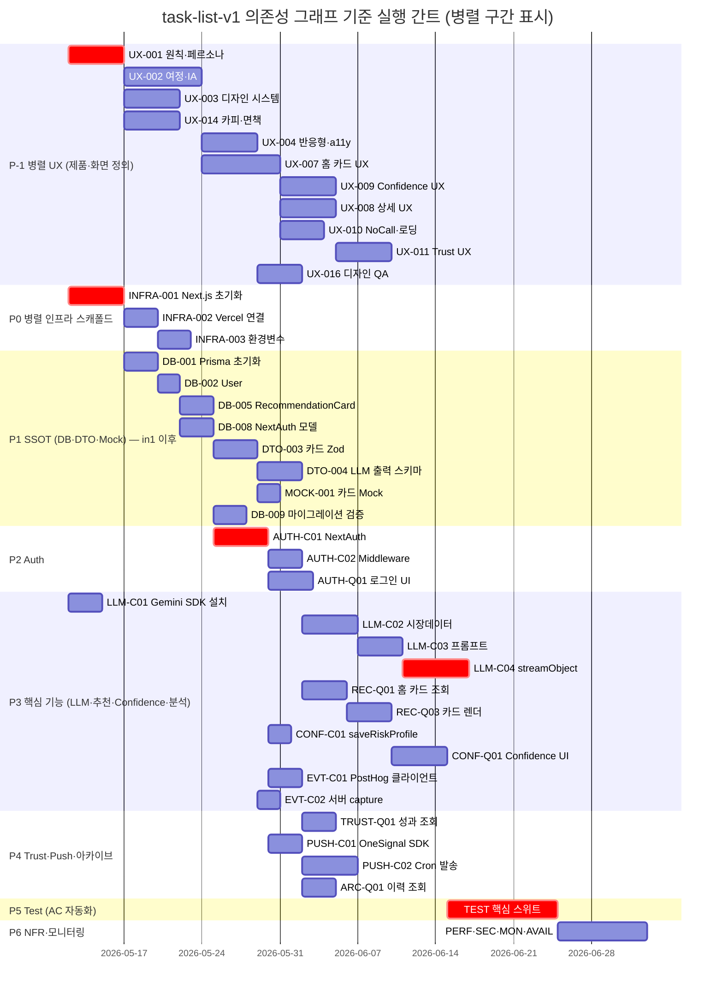

# 개발 간트 차트 (의존성 그래프 기준)

**Source:** `tasks/task-list-v1.md` — §의존성 그래프(Mermaid), §권장 실행 순서(Phase -1 ~ 6)  
**Purpose:** 병렬·독립 실행 구간을 한눈에 보기 위한 **상대 일정(일 단위 플레이스홀더)**. 실제 일수는 팀 속도에 맞게 조정한다.

---

## 1. 병렬로 바로 시작 가능한 작업 (의존성 None 또는 Infra와 무관)

| 트랙 | Task ID | 비고 |
|------|---------|------|
| A | **UX-001** | 디자인 Phase 진입점 |
| B | **INFRA-001** | Next.js 스캐폴드 — DB-001 전제 |
| C | **DTO-007**, **DTO-008**, **DTO-009** | SRS상 선행 None — 계약 문서·DTO 초안은 DB와 병행 가능 |
| D | **MOCK-004** | 외부 API Mock — LLM-C02 전제 |
| E | **LLM-C01** | Gemini SDK 패키지 설치 — DB와 병행 가능(레포에 패키지 추가) |

`INFRA-001` 완료 후 **DB-001**이 열리므로, **UX 전체**와 **Infra→DB→DTO 핵심 체인**은 초반에 **두 갈래**로 나뉜다.

---

## 2. 간트 차트 (Mermaid)

아래 차트에서 **같은 날짜에 시작하는 막대**는 서로 다른 담당/에이전트가 **동시에** 가져갈 수 있는 구간이다.  
`crit`(빨간색)은 **엔지니어링 크리티컬 패스**(배포 가능 MVP에 직결)이다.

### 차트 읽는 법

- **2026-05-12**에 **UX-001**, **INFRA-001**, **LLM-C01**이 동시에 시작 가능 → **디자인 / 스캐폴드 / LLM SDK** 병렬.
- **INFRA-001** 완료 후 같은 주에 **DB-001** 시작 (그래프의 `INFRA-001 --> DB-001`).
- **DTO-009 / DTO-007 / DTO-008 / MOCK-004 / LLM-C01**은 문서상 선행이 비어 있어, 리소스만 있으면 **Week 1부터 별도 브랜치**로 진행 가능 (위 간트에서는 생략·축약됨 — 필요 시 동일 시작일로 막대 추가).
- **AUTH-C01**은 **DB-008** 이후 — NextAuth 모델이 있어야 함.
- **REC-Q01**은 **AUTH-C02** 이후 — 미들웨어 가드 전제.
- **LLM-C04** 이후에 **성능(PERF-001)** 등이 의미 있음 (간트에서는 P6에 묶음).
- 실제 SRS상 **LLM-C03**은 **LLM-C01 + LLM-C02 + DTO-004** 모두 필요 — 위에서는 `lc1`이 `lc3`보다 먼저 끝난다고 가정해 `after lc2`만 표기했다.

---

## 3. Phase × 병렬도 요약 (한 장 표)

| Phase | 이름 | 앞 Phase와 병렬 가능? | 비고 |
|-------|------|------------------------|------|
| **-1** | UI/UX | **P0와 병렬** | UX-001 ↔ INFRA-001 동시 시작 |
| **0** | Scaffolding | DB와 직렬: **INFRA-001 → DB-001** | Vercel 연결은 스캐폴드 직후 |
| **1** | SSOT | UX-007 이전까지 **UX 트랙과 병렬** | DTO/MOCK은 DB-005·DTO-003에 묶임 |
| **2** | Auth | **DB-008 완료 후** | AUTH-C01 이후 C02·Q01 분기 가능 |
| **3** | Core | **ONB / REC / CONF / EVT / LLM** 내부 병렬 다수 | 예: EVT-C01 ∥ LLM-C02 착수 (ac1 이후) |
| **4** | Trust·Push | **TRUST-Q01 ∥ PUSH-C01** (둘 다 ac1 또는 ac2 이후) | PUSH-C02는 PC01·카드 데이터 필요 |
| **5** | Test | 기능 완료 후 직렬 다발 | CQRS 구현 후 AC 테스트 |
| **6** | NFR | Test와 **부분 병렬** (스모크 이후 모니터링 선행 가능) | 팀 정책에 따름 |

---

## 4. Mermaid 간트 제한 사항

GitHub·일부 뷰어는 `gantt` 렌더를 지원하지만, **Cursor 미리보기**는 버전에 따라 다를 수 있다. 이 경우 동일 내용을 [mermaid.live](https://mermaid.live)에 붙여 확인하면 된다.

---

*본 파일은 `task-list-v1.md`의 간소화된 의존성 다이어그램을 시각화한 보조 문서이며, 일정 수치는 예시다.*
