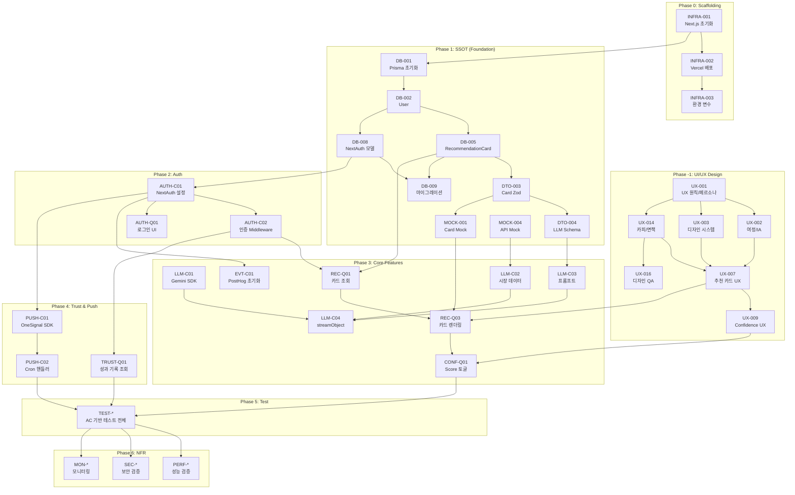

# 개발 태스크 목록 명세서 (Task Breakdown)

**Source Document:** SRS-001 v0.3 (`SRS-v1.md`)  
**Date:** 2026-04-22  
**Author:** Technical Project Manager / System Architect (AI)  
**Methodology:** 5-Step Extraction (UX Design → Contract → Logic → Test → NFR + Dependency)

---

## 목차

1. [Step 0. UI/UX 디자인 태스크](#step-0-uiux-디자인-태스크)
2. [Step 1. 계약 및 데이터 명세 태스크](#step-1-계약-및-데이터-명세-태스크)
3. [Step 2. 로직 및 상태 변경 태스크 (CQRS)](#step-2-로직-및-상태-변경-태스크-cqrs)
4. [Step 3. 테스트 태스크 (AC → Test Code)](#step-3-테스트-태스크-ac--test-code)
5. [Step 4. 비기능 요구사항 및 인프라 태스크](#step-4-비기능-요구사항-및-인프라-태스크)
6. [의존성 그래프](#의존성-그래프)
7. [전체 태스크 요약 테이블](#전체-태스크-요약-테이블)

---

## Step 0. UI/UX 디자인 태스크

> **목적:** 백엔드/프론트엔드 개발 및 인프라 구성과 분리하여, 제품 경험의 화면 구조·상태·카피·접근성·디자인 QA 기준을 먼저 고정한다.  
> 개발 태스크는 이 섹션의 산출물을 선행 입력으로 사용하며, UI 구현과 디자인 의사결정을 혼동하지 않는다.

### Epic: UI/UX Design — Foundation & Flow

| Task ID | Epic | Feature (기능명) | 관련 SRS/PRD 섹션 | 선행 태스크 (Dependencies) | 복잡도 |
|---|---|---|---|---|---|
| UX-001 | UI/UX Design | 제품 UX 원칙·페르소나·JTBD 정리 — 준경험 투자자/불신형 유료 독자, 차트 없는 결과 중심 UI, Trust Layer 원칙 | PRD §1, §2, ADR-001/004/005, SRS §2.1 | None | M |
| UX-002 | UI/UX Design | 핵심 사용자 여정 및 IA/화면 목록 정의 — 로그인, 온보딩, 홈, 추천 상세, 설정, 이력, 푸시 딥링크, 빈 상태 | PRD §3, §4.1, SRS §3.4 | UX-001 | M |
| UX-003 | UI/UX Design | 디자인 시스템 기초 정의 — Tailwind/shadcn 컴포넌트 사용 원칙, 컬러/타이포/spacing/token, 상태별 스타일 | SRS C-TEC-004, §2.2, §3.1 | UX-001 | M |
| UX-004 | UI/UX Design | 반응형·접근성 기준 정의 — PC/모바일 브라우저, 키보드 조작, focus, contrast, screen reader label, touch target | SRS §3.1 Web/Mobile, REQ-NF-005, C-TEC-004 | UX-002, UX-003 | M |

### Epic: UI/UX Design — Screen & Interaction Specs

| Task ID | Epic | Feature (기능명) | 관련 SRS/PRD 섹션 | 선행 태스크 (Dependencies) | 복잡도 |
|---|---|---|---|---|---|
| UX-005 | UI/UX Design | 로그인·세션 UX 명세 — OAuth/이메일 로그인, 미인증 리다이렉트, 세션 만료/재로그인, 보호 경로 안내 | SRS F10 REQ-FUNC-090~092 | UX-002, UX-003 | L |
| UX-006 | UI/UX Design | 온보딩·관심 종목 설정 UX 명세 — 최소 1개/최대 3개 선택, 초과 선택 차단, 설정 화면 수정 흐름 | SRS F1 REQ-FUNC-001~003, PRD §4.1 Must | UX-002, UX-003, UX-014 | M |
| UX-007 | UI/UX Design | 홈 추천 카드 UX 명세 — 방향/가격/보유기간/Confidence/reasonLine 정보 위계, 면책 고정, 가격 복사·브로커 이동 CTA | SRS F2/F3, REQ-FUNC-010~023, REQ-FUNC-085 | UX-002, UX-003, UX-014, MOCK-001 | H |
| UX-008 | UI/UX Design | 추천 상세·차트 없는 결과 해석 UX 명세 — 메인 폴드 차트 비노출, 상세 정보 배치, 유사 패턴/성과 영역 진입 | SRS REQ-FUNC-012, REQ-FUNC-014, ADR-004 | UX-007 | M |
| UX-009 | UI/UX Design | Confidence Score 선택 인터랙션 명세 — aggressive/balanced/conservative 3단계, 변경값 피드백, 300ms 전환 체감, 저장 상태 복원 | SRS F4 REQ-FUNC-030~033, REQ-NF-003, ADR-002 | UX-007 | H |
| UX-010 | UI/UX Design | No Call·loading·empty·error 상태 UX/콘텐츠 명세 — LLM 실패, 데이터 부족, 성과 부족, 사용자에게 5xx 미노출 | SRS REQ-FUNC-013, REQ-FUNC-042, REQ-FUNC-083 | UX-007, UX-008, UX-014 | M |
| UX-011 | UI/UX Design | Trust Layer UX 명세 — 한 줄 이유 확장, 성과 카드 성공/실패/수익률, "데이터 축적 중", 유사 패턴 숨김/노출 기준 | SRS F5 REQ-FUNC-040~043, ADR-005 | UX-008, UX-010, MOCK-002 | M |
| UX-012 | UI/UX Design | 추천 이력 아카이브·설정 정보 구조 UX 명세 — 종목별 이력 목록, 성공/실패 표기, realizedReturn, 설정 진입 경로 | SRS F8 REQ-FUNC-070, F1 REQ-FUNC-003 | UX-002, UX-003 | L |
| UX-013 | UI/UX Design | 푸시 권한·아침 브리핑·딥링크 UX 명세 — consent prompt, 알림 문구, 홈/상세 랜딩, 실패 fallback | SRS F6 REQ-FUNC-050~052, REQ-NF-004 | UX-002, UX-007, UX-014 | M |

### Epic: UI/UX Design — Validation & Handoff

| Task ID | Epic | Feature (기능명) | 관련 SRS/PRD 섹션 | 선행 태스크 (Dependencies) | 복잡도 |
|---|---|---|---|---|---|
| UX-014 | UI/UX Design | UI 카피·법적 면책·마이크로카피 인벤토리 — 투자 자문 아님, 최대 3개 제한, No Call, 데이터 축적 중, 인증/개인정보 문구 | SRS REQ-FUNC-002, REQ-FUNC-013, REQ-FUNC-042, REQ-FUNC-085, Legal | UX-001 | M |
| UX-015 | UI/UX Design | 제품 이벤트·설문 터치포인트 UX 맵 — rec_card_view, confidence_view/change, reason_expand, performance_card_view, price_copy, broker_redirect, UX 설문 | PRD §1.2, §5.4, SRS F7 REQ-FUNC-060~061 | UX-007, UX-009, UX-011, UX-013, DTO-009 | M |
| UX-016 | UI/UX Design | 디자인 QA·사용성 테스트 핸드오프 체크리스트 — 차트 비노출, 면책 고정, 시각 회귀, 접근성, SUS/과업 완료율 기준 | PRD EXP-02/05, BM-02/03/04, SRS REQ-FUNC-014 | UX-004, UX-010, UX-014, UX-015 | M |

## Step 1. 계약 및 데이터 명세 태스크

> **목적:** 백엔드와 프론트엔드의 **단일 진실 공급원(SSOT)**을 확립한다.  
> 에이전트가 이후 Feature 구현 시 참조할 데이터 구조와 통신 계약을 먼저 정의한다.

### Epic: Foundation — 데이터베이스 스키마

| Task ID | Epic | Feature (기능명) | 관련 SRS 섹션 | 선행 태스크 (Dependencies) | 복잡도 |
|---|---|---|---|---|---|
| DB-001 | Foundation | Prisma 프로젝트 초기화 및 SQLite/Supabase 듀얼 데이터소스 설정 | §1.5.2 C-TEC-003, §6.2 | None | M |
| DB-002 | Foundation | `User` 모델 스키마 작성 — id, email, name, signupChannel, timezone, consentPush, createdAt, updatedAt | §6.2.1 User | DB-001 | L |
| DB-003 | Foundation | `RiskProfile` 모델 스키마 작성 — userId(1:1 unique FK), riskMode, updatedAt | §6.2.2 RiskProfile | DB-002 | L |
| DB-004 | Foundation | `Watchlist` 모델 스키마 작성 — userId(FK), ticker?, sector?, priority, createdAt | §6.2.3 Watchlist | DB-002 | L |
| DB-005 | Foundation | `RecommendationCard` 모델 스키마 작성 — 전체 필드(entry/target 단일가+범위, holdDays, confidenceScore, reasonLine, status, validUntil) | §6.2.4 RecommendationCard | DB-002 | M |
| DB-006 | Foundation | `EvidenceSnapshot` 모델 스키마 작성 — recId(FK), newsSignalScore, volumeSignalScore, communitySignalScore, patternTag | §6.2.5 EvidenceSnapshot | DB-005 | L |
| DB-007 | Foundation | `PerformanceRecord` 모델 스키마 작성 — recId(FK), ticker, predictedDirection, realizedReturn, hitFlag, evaluationWindowDays, evaluatedAt | §6.2.6 PerformanceRecord | DB-005 | L |
| DB-008 | Foundation | NextAuth.js 호환 모델 (Account, Session, VerificationToken) 추가 및 User 모델 연동 | §6.2.1, F10 REQ-FUNC-090 | DB-002 | M |
| DB-009 | Foundation | Prisma 초기 마이그레이션 스크립트 생성 및 로컬 SQLite / Supabase PostgreSQL 양쪽 검증 | §1.5.2 C-TEC-003, ASS-010 | DB-002 ~ DB-008 | M |

### Epic: Foundation — API/Server Action DTO 및 Zod 스키마 정의

| Task ID | Epic | Feature (기능명) | 관련 SRS 섹션 | 선행 태스크 (Dependencies) | 복잡도 |
|---|---|---|---|---|---|
| DTO-001 | Foundation | `saveWatchlist()` Server Action 입력 Zod 스키마 정의 — items 배열(최대 3개), ticker/sector 중 1개 이상 필수 검증 | §6.1, §6.2.3 제약 | DB-004 | M |
| DTO-002 | Foundation | `saveRiskProfile()` Server Action 입력 Zod 스키마 정의 — riskMode enum 검증 (`aggressive`/`balanced`/`conservative`) | §6.1, REQ-FUNC-033 | DB-003 | L |
| DTO-003 | Foundation | `RecommendationCard` 출력 Zod 스키마 정의 — ticker, direction, entryPrice/Range, targetPrice/Range, holdDays(1~10), confidenceScore, reasonLine(1~160자), status | §6.2.4 제약, REQ-FUNC-020 | DB-005 | H |
| DTO-004 | Foundation | `RecommendationCard` LLM Structured Output (streamObject) 입력 JSON Schema 정의 — 3벌 카드(aggressive/balanced/conservative) 응답 구조 | §3.1 Google Gemini, REQ-FUNC-082 | DTO-003 | H |
| DTO-005 | Foundation | `GET /api/recommendations/today` 응답 DTO 정의 — RecommendationCard 배열(1~3개) 또는 No Call 상태 응답 | §6.1, REQ-FUNC-010 | DTO-003 | M |
| DTO-006 | Foundation | `GET /api/recommendations/[recId]` 응답 DTO 정의 — 상세(이유, 성과, 유사 패턴) | §6.1 | DTO-003, DB-006, DB-007 | M |
| DTO-007 | Foundation | `/api/cron/morning-briefing` 응답 DTO 정의 — `{ scheduled, sent, failed }` | §6.1 | None | L |
| DTO-008 | Foundation | `/api/admin/health` 응답 DTO 정의 — `{ freshness, nullRate }` | §6.1, REQ-NF-042 | None | L |
| DTO-009 | Foundation | PostHog 이벤트 taxonomy 스키마 정의 — 클라이언트 16종 + 서버 3종 이벤트명 · 속성(properties) 명세 문서 작성 | §F7 REQ-FUNC-060, REQ-FUNC-061 | None | M |
| DTO-010 | Foundation | `RecommendationCard` 가격 검증 Zod `.refine()` 규칙 구현 — entryPrice 또는 (entryRangeLow AND entryRangeHigh) 중 택 1 필수, target 동일, 가격 > 0 | §6.2.4 제약, REQ-FUNC-021 | DTO-003 | M |

### Epic: Foundation — Mock 데이터

| Task ID | Epic | Feature (기능명) | 관련 SRS 섹션 | 선행 태스크 (Dependencies) | 복잡도 |
|---|---|---|---|---|---|
| MOCK-001 | Foundation | 프론트엔드 UI 개발용 추천 카드 Mock 데이터 생성 — 정상 카드 3벌(aggressive/balanced/conservative) + No Call 카드 1개 | §F2, §6.2.4 | DTO-003 | L |
| MOCK-002 | Foundation | 프론트엔드 UI 개발용 성과 기록(PerformanceRecord) Mock 데이터 생성 — 성공/실패 혼합 30건 + 빈 상태(0건) | §F5, §6.2.6 | DB-007 | L |
| MOCK-003 | Foundation | 프론트엔드 UI 개발용 사용자(User + RiskProfile + Watchlist) Mock 데이터 생성 | §6.2.1~3 | DB-002, DB-003, DB-004 | L |
| MOCK-004 | Foundation | 외부 API Mock 설정 — Yahoo Finance/Finnhub OHLCV + 뉴스 응답 고정 Mock JSON | §3.1 외부 시스템 | None | M |

---

## Step 2. 로직 및 상태 변경 태스크 (CQRS)

> **목적:** SRS의 기능적 요구사항을 **Read(Query)**와 **Write(Command)**로 분리하여 태스크를 도출한다.  
> 각 태스크는 **닫힌 문맥(Closed Context)**을 가지며, 하나의 상태 변경 목적에만 집중한다.

### Epic: Auth — 사용자 인증 (F10)

| Task ID | Epic | Feature (기능명) | 관련 SRS 섹션 | 선행 태스크 (Dependencies) | 복잡도 |
|---|---|---|---|---|---|
| AUTH-C01 | Auth | [Command] NextAuth.js 초기 설정 — Google/Kakao OAuth Provider 등록, JWT 세션 전략 설정, `/api/auth/[...nextauth]` Route 구현 | §F10 REQ-FUNC-090, §6.1 | DB-008 | H |
| AUTH-C02 | Auth | [Command] Next.js Middleware 기반 인증 가드 구현 — 미인증 사용자를 `/login`으로 리다이렉트하는 세션 검증 로직 | §F10 REQ-FUNC-091 | AUTH-C01 | M |
| AUTH-C03 | Auth | [Command] JWT 세션 자동 갱신(refresh) 로직 구현 — 만료 임박 세션 갱신 또는 재로그인 유도 | §F10 REQ-FUNC-092 | AUTH-C01 | M |
| AUTH-C04 | Auth | [Command] 사용자 탈퇴 처리 Server Action 구현 — Prisma 데이터 삭제/익명화 + PostHog person profile 비식별 + OneSignal subscription 삭제 요청 | §F10 REQ-FUNC-093 | AUTH-C01, PUSH-C01 | H |
| AUTH-Q01 | Auth | [Query/UI] 로그인 페이지 UI 구현 — OAuth 버튼(Google/Kakao), 이메일 로그인, shadcn/ui 기반 | §F10 REQ-FUNC-090 | AUTH-C01, UX-005, UX-014 | M |

### Epic: Onboarding — 관심 종목/섹터 등록 (F1)

| Task ID | Epic | Feature (기능명) | 관련 SRS 섹션 | 선행 태스크 (Dependencies) | 복잡도 |
|---|---|---|---|---|---|
| ONB-C01 | Onboarding | [Command] `saveWatchlist()` Server Action 구현 — Zod 검증 + Prisma watchlist upsert (최대 3개 제한 서버 검증) | §F1 REQ-FUNC-001, §6.1 | DTO-001, AUTH-C01 | M |
| ONB-C02 | Onboarding | [Command] 관심 종목/섹터 수정 Server Action 구현 — 기존 watchlist 갱신, 변경 반영 확인 | §F1 REQ-FUNC-003 | ONB-C01 | M |
| ONB-Q01 | Onboarding | [Query/UI] 온보딩 화면 구현 — 종목/섹터 선택 UI(shadcn/ui), 최소 1개 검증, 3개 초과 선택 차단 안내 메시지 | §F1 REQ-FUNC-001, REQ-FUNC-002 | ONB-C01, MOCK-003, UX-006, UX-014 | M |
| ONB-Q02 | Onboarding | [Query/UI] 설정 화면 관심 종목 편집 UI 구현 — 기존 watchlist 조회 + 수정 인터페이스 | §F1 REQ-FUNC-003 | ONB-C02, UX-006, UX-012 | M |

### Epic: Recommendation — 추천 카드 조회 및 노출 (F2, F3)

| Task ID | Epic | Feature (기능명) | 관련 SRS 섹션 | 선행 태스크 (Dependencies) | 복잡도 |
|---|---|---|---|---|---|
| REC-Q01 | Recommendation | [Query] 홈 화면 Server Component — Prisma에서 오늘 생성된 cached 카드 조회 로직 구현 | §F2 REQ-FUNC-010, §3.4.1 | DB-005, DTO-005, AUTH-C02 | M |
| REC-Q02 | Recommendation | [Query] 추천 상세 화면 Server Component — `GET /api/recommendations/[recId]` 또는 RSC 직접 Prisma 조회(이유, 성과, 유사 패턴) | §F2 REQ-FUNC-012, §6.1 | DB-005, DB-006, DB-007, DTO-006 | M |
| REC-Q03 | Recommendation | [Query/UI] 추천 카드 렌더링 Client Component — ticker, direction, entryPrice, holdDays, confidenceScore, reasonLine 표시 + 면책 문구 고정 | §F2 REQ-FUNC-011, REQ-FUNC-012, §F9 REQ-FUNC-085 | REC-Q01, MOCK-001, UX-007, UX-014 | M |
| REC-Q04 | Recommendation | [Query/UI] No Call 상태 카드 UI 구현 — 데이터 부족/LLM 실패 시 대체 안내 문구 표시, HTTP 5xx 미발생 | §F2 REQ-FUNC-013 | REC-Q03, UX-010 | L |
| REC-Q05 | Recommendation | [Query/UI] 차트 위젯 비노출 검증 — 메인 폴드 영역에 캔들/RSI/MACD 미렌더링 (디자인 QA) | §F2 REQ-FUNC-014, ADR-004 | REC-Q03, UX-008, UX-016 | L |
| REC-C01 | Recommendation | [Command/UI] 가격 복사(price_copy) 기능 구현 — 클립보드 API + PostHog `posthog.capture('price_copy')` 이벤트 발행 | §F3 REQ-FUNC-022 | REC-Q03, EVT-C01, UX-007, UX-015 | L |
| REC-C02 | Recommendation | [Command/UI] 브로커 이동(broker_redirect) 기능 구현 — 외부 링크 이동 + PostHog `posthog.capture('broker_redirect')` 이벤트 발행 | §F3 REQ-FUNC-023 | REC-Q03, EVT-C01, UX-007, UX-015 | L |

### Epic: Confidence — Confidence Score 선택 (F4)

| Task ID | Epic | Feature (기능명) | 관련 SRS 섹션 | 선행 태스크 (Dependencies) | 복잡도 |
|---|---|---|---|---|---|
| CONF-C01 | Confidence | [Command] `saveRiskProfile()` Server Action 구현 — Zod 검증(허용값 외 거부) + Prisma riskProfile upsert + `revalidatePath('/')` | §F4 REQ-FUNC-032, REQ-FUNC-033, §3.4.2 | DTO-002, AUTH-C01 | M |
| CONF-Q01 | Confidence | [Query/UI] Confidence Score 3단계 토글 UI 구현 — aggressive/balanced/conservative 선택, 기 생성된 3벌 카드 중 해당 모드 즉시 전환(≤300ms) | §F4 REQ-FUNC-030, REQ-FUNC-031 | CONF-C01, REC-Q03, MOCK-001, UX-009 | H |
| CONF-Q02 | Confidence | [Query] 세션 재진입 시 저장된 riskMode 기본값 복원 로직 — Prisma에서 RiskProfile 조회 후 UI 초기값 설정 | §F4 REQ-FUNC-032 | CONF-C01 | L |

### Epic: Trust Layer — 한 줄 이유 및 성과 이력 (F5)

| Task ID | Epic | Feature (기능명) | 관련 SRS 섹션 | 선행 태스크 (Dependencies) | 복잡도 |
|---|---|---|---|---|---|
| TRUST-Q01 | Trust Layer | [Query] 성과 기록 조회 Server Component — `performanceRecord.findMany()` 최근 30건/30일, 성공+실패 포함, 최신순 정렬 | §F5 REQ-FUNC-041, §6.3.3 | DB-007, AUTH-C02 | M |
| TRUST-Q02 | Trust Layer | [Query/UI] 성과 카드 렌더링 — 성공률, 실패율, 수익률 표시(shadcn/ui Card) + 빈 상태 시 "데이터 축적 중" 표시 | §F5 REQ-FUNC-041, REQ-FUNC-042 | TRUST-Q01, MOCK-002, UX-011 | M |
| TRUST-Q03 | Trust Layer | [Query/UI] 한 줄 이유(reasonLine) 표시 검증 — 160자 이하 비공백 문자열 렌더링, reason_expand 클릭 시 PostHog 이벤트 | §F5 REQ-FUNC-040 | REC-Q03, EVT-C01, UX-011, UX-015 | L |
| TRUST-Q04 | Trust Layer | [Query/UI] 유사 패턴 참고 섹션 (Could) — 데이터 존재 시 표시, 미존재 시 조용히 숨김 | §F5 REQ-FUNC-043 | TRUST-Q01, UX-011 | L |

### Epic: Push — 아침 브리핑 푸시 알림 (F6)

| Task ID | Epic | Feature (기능명) | 관련 SRS 섹션 | 선행 태스크 (Dependencies) | 복잡도 |
|---|---|---|---|---|---|
| PUSH-C01 | Push | [Command] OneSignal Web SDK 초기 설정 — 프론트엔드 푸시 구독 연동, 사용자 consentPush 상태 관리 | §3.1 OneSignal, REQ-FUNC-050 | AUTH-C01 | M |
| PUSH-C02 | Push | [Command] `/api/cron/morning-briefing` Route Handler 구현 — CRON_SECRET 검증, consentPush=true 사용자 조회, OneSignal REST API 발송, captureServerEvent('push_sent') | §F6 REQ-FUNC-050, §3.4.3, §6.3.4 | PUSH-C01, DB-005, EVT-C02 | H |
| PUSH-C03 | Push | [Command] Vercel Cron 설정 — `vercel.json`에 morning-briefing 크론 표현식 등록 | §3.1 Vercel Cron | PUSH-C02 | L |
| PUSH-Q01 | Push | [Query/UI] 푸시 수신 딥링크 랜딩 처리 — 푸시 탭 → 딥링크 파싱 → 홈/상세 화면 라우팅(≤1,000ms) + PostHog push_open/deeplink_success/deeplink_fail 이벤트 | §F6 REQ-FUNC-051 | PUSH-C01, REC-Q01, EVT-C01, UX-013, UX-015 | M |
| PUSH-C04 | Push | [Command] 푸시 거부/권한 회수 사용자 발송 제외 로직 — OneSignal 구독 상태 + consentPush 양쪽 기준 필터링, 오발송 0% | §F6 REQ-FUNC-052 | PUSH-C02 | M |

### Epic: Analytics — 행동 이벤트 추적 (F7)

| Task ID | Epic | Feature (기능명) | 관련 SRS 섹션 | 선행 태스크 (Dependencies) | 복잡도 |
|---|---|---|---|---|---|
| EVT-C01 | Analytics | [Command] PostHog 클라이언트 SDK(`posthog-js`) 초기화 — Next.js App Router 통합, 사용자 식별(distinctId) 연동 | §F7 REQ-FUNC-060, §3.1 PostHog | AUTH-C01 | M |
| EVT-C02 | Analytics | [Command] PostHog 서버 측 capture helper 구현 — `captureServerEvent()` 유틸 함수, 서버 기원 이벤트 3종(llm_call_failed, rec_validation_failed, push_sent) 전송 | §F7 REQ-FUNC-060 | DTO-009 | M |
| EVT-C03 | Analytics | [Command] 클라이언트 행동 이벤트 16종 연동 — 각 UI 터치포인트에 `posthog.capture()` 호출 삽입 | §F7 REQ-FUNC-060 | EVT-C01, REC-Q03, CONF-Q01, TRUST-Q02, PUSH-Q01 | M |
| EVT-Q01 | Analytics | [Query] PostHog 대시보드 이벤트 taxonomy/속성 스키마 적용 및 KPI 대시보드 구성 가이드 작성 — ADR, CTR, Confidence Engagement Rate, D7/D30 Retention | §F7 REQ-FUNC-061, §4.2.5 REQ-NF-040 | DTO-009, EVT-C03 | M |

### Epic: Archive — 추천 이력 아카이브 (F8)

| Task ID | Epic | Feature (기능명) | 관련 SRS 섹션 | 선행 태스크 (Dependencies) | 복잡도 |
|---|---|---|---|---|---|
| ARC-Q01 | Archive | [Query] 종목별 과거 추천 결과 목록 조회 — Server Component에서 Prisma 쿼리(ticker 기준, hitFlag, realizedReturn 포함, 최신순) | §F8 REQ-FUNC-070 | DB-005, DB-007, AUTH-C02 | M |
| ARC-Q02 | Archive | [Query/UI] 추천 이력 목록 화면 구현 — 종목별 리스트 뷰, 성공/실패 표기, shadcn/ui Table/Card | §F8 REQ-FUNC-070 | ARC-Q01, UX-012 | M |

### Epic: LLM Pipeline — LLM 기반 추천 카드 생성 (F9)

| Task ID | Epic | Feature (기능명) | 관련 SRS 섹션 | 선행 태스크 (Dependencies) | 복잡도 |
|---|---|---|---|---|---|
| LLM-C01 | LLM Pipeline | [Command] Vercel AI SDK + Google Gemini 초기 설정 — `@ai-sdk/google` 패키지 설치, `GEMINI_MODEL` 환경 변수 기반 모델 초기화 | §F9 REQ-FUNC-080, C-TEC-005/006 | None | M |
| LLM-C02 | LLM Pipeline | [Command] 외부 시장 데이터 수집 모듈 — Yahoo Finance/Finnhub API 호출, Next.js `fetch` 캐시(`revalidate`) 적용, OHLCV + 뉴스 JSON 반환 | §3.1 Yahoo Finance/Finnhub, ASS-006 | MOCK-004 | H |
| LLM-C03 | LLM Pipeline | [Command] LLM 프롬프트 구성 모듈 — watchlist, OHLCV 요약, 뉴스 시그널, risk_mode 4종 컨텍스트 조합, 3벌 카드(aggressive/balanced/conservative) 동시 생성 지시, 면책 조항 포함 | §F9 REQ-FUNC-082, REQ-FUNC-085 | LLM-C01, LLM-C02, DTO-004 | H |
| LLM-C04 | LLM Pipeline | [Command] `streamObject()` 기반 카드 생성 실행 로직 — Vercel AI SDK streamObject 호출, Structured Output 수신, Zod 스키마 검증 | §F9 REQ-FUNC-080, REQ-FUNC-081, §6.3.2 | LLM-C03, DTO-003, DTO-010 | H |
| LLM-C05 | LLM Pipeline | [Command] 카드 검증 실패 시 1회 재시도 로직 — Zod 검증 실패 → streamObject 재호출 → 재검증 → 최종 실패 시 No Call + rec_validation_failed 이벤트 | §F9 REQ-FUNC-081, §6.3.2 | LLM-C04, EVT-C02 | H |
| LLM-C06 | LLM Pipeline | [Command] LLM 호출 실패 에러 핸들링 — API 에러/timeout/rate limit 감지 → No Call 카드 저장 → llm_call_failed 이벤트 → 사용자에게 안내 문구만 표시 | §F9 REQ-FUNC-083 | LLM-C04, EVT-C02 | M |
| LLM-C07 | LLM Pipeline | [Command] 생성된 카드 Prisma 저장 — `recommendationCard.createMany()` (published 3벌 또는 no_call 1개) | §6.3.2 | LLM-C04, DB-005 | M |
| LLM-C08 | LLM Pipeline | [Command] EvidenceSnapshot 저장 — 카드 생성 시 사용된 뉴스/거래량/커뮤니티 시그널 점수 스냅샷 | §6.2.5 | LLM-C07, DB-006 | L |
| LLM-Q01 | LLM Pipeline | [Query] GEMINI_MODEL 환경 변수 교체 검증 — 모델 변경 후 동일 스키마 출력 호환성 확인 | §F9 REQ-FUNC-084 | LLM-C04 | L |

---

## Step 3. 테스트 태스크 (AC → Test Code)

> **목적:** SRS의 Acceptance Criteria를 **자동화 가능한 테스트 코드 작성 태스크**로 변환한다.  
> 에이전트에게 "이 테스트가 통과할 때까지 수정하라"고 명령할 수 있도록 AC를 코드로 구체화한다.

### Epic: Test — 온보딩 (F1)

| Task ID | Epic | Feature (기능명) | 관련 SRS 섹션 | 선행 태스크 (Dependencies) | 복잡도 |
|---|---|---|---|---|---|
| TEST-F1-01 | Test | [Test] saveWatchlist GWT 단위 테스트 — 1개 선택 시 저장 성공, 3개 초과 시 Zod 검증 오류, ticker/sector 모두 null 시 오류 | §F1 REQ-FUNC-001~003 AC | ONB-C01 | M |

### Epic: Test — 추천 카드 (F2, F3)

| Task ID | Epic | Feature (기능명) | 관련 SRS 섹션 | 선행 태스크 (Dependencies) | 복잡도 |
|---|---|---|---|---|---|
| TEST-F2-01 | Test | [Test] 추천 카드 조회 GWT 단위 테스트 — 카드 ≤3개 반환, ticker/direction/confidenceScore 100% non-null, No Call 시 HTTP 200 + 안내문구 | §F2 REQ-FUNC-010~013 AC | REC-Q01, REC-Q04 | M |
| TEST-F3-01 | Test | [Test] 가격/보유기간 Zod 검증 단위 테스트 — entryPrice 또는 Range 필수, holdDays 1~10 정수, 가격 ≤ 0 차단 + rec_validation_failed 이벤트 발행 검증 | §F3 REQ-FUNC-020, REQ-FUNC-021 AC | DTO-010, LLM-C05 | M |

### Epic: Test — Confidence Score (F4)

| Task ID | Epic | Feature (기능명) | 관련 SRS 섹션 | 선행 태스크 (Dependencies) | 복잡도 |
|---|---|---|---|---|---|
| TEST-F4-01 | Test | [Test] saveRiskProfile GWT 단위 테스트 — 허용값 저장 성공, 비허용값(`invalid_mode`) Zod 검증 실패 → 기존 값 보존, 세션 재진입 시 기본값 복원 | §F4 REQ-FUNC-031~033 AC | CONF-C01 | M |
| TEST-F4-02 | Test | [Test] Confidence Score UI 전환 응답 시간 테스트 — 3벌 카드 전환 ≤ 300ms 성능 검증 (클라이언트 타이밍 측정) | §F4 REQ-FUNC-031, REQ-NF-003 | CONF-Q01 | M |

### Epic: Test — Trust Layer (F5)

| Task ID | Epic | Feature (기능명) | 관련 SRS 섹션 | 선행 태스크 (Dependencies) | 복잡도 |
|---|---|---|---|---|---|
| TEST-F5-01 | Test | [Test] reasonLine 검증 단위 테스트 — 길이 1~160, null/공백 거부, 게시 카드 100% 충족 | §F5 REQ-FUNC-040 AC | DTO-003 | L |
| TEST-F5-02 | Test | [Test] 성과 기록 조회 GWT 통합 테스트 — 30건/30일 제한, 성공+실패 모두 포함, 빈 상태 시 UI 에러 없음 | §F5 REQ-FUNC-041, REQ-FUNC-042 AC | TRUST-Q01, TRUST-Q02 | M |

### Epic: Test — 푸시 알림 (F6)

| Task ID | Epic | Feature (기능명) | 관련 SRS 섹션 | 선행 태스크 (Dependencies) | 복잡도 |
|---|---|---|---|---|---|
| TEST-F6-01 | Test | [Test] 아침 브리핑 Cron 통합 테스트 — CRON_SECRET 검증 성공/실패, consentPush=true 필터링, OneSignal API mock 발송 성공 응답 검증 | §F6 REQ-FUNC-050, REQ-FUNC-052 AC | PUSH-C02, PUSH-C04 | H |
| TEST-F6-02 | Test | [Test] 딥링크 랜딩 E2E 테스트 — 푸시 탭 → 홈/상세 이동 성공, deeplink_fail 이벤트 비발행 | §F6 REQ-FUNC-051 AC | PUSH-Q01 | M |

### Epic: Test — LLM Pipeline (F9)

| Task ID | Epic | Feature (기능명) | 관련 SRS 섹션 | 선행 태스크 (Dependencies) | 복잡도 |
|---|---|---|---|---|---|
| TEST-F9-01 | Test | [Test] LLM Structured Output Zod 스키마 검증 단위 테스트 — 모든 필수 필드 존재 및 타입 일치, 3벌 카드 스키마 준수 | §F9 REQ-FUNC-081 AC | LLM-C04, DTO-004 | M |
| TEST-F9-02 | Test | [Test] LLM 호출 실패 시나리오 단위 테스트 — timeout/5xx/rate limit → No Call 반환 + llm_call_failed 이벤트 + 에러 페이지 미노출 검증 | §F9 REQ-FUNC-083 AC | LLM-C06 | M |
| TEST-F9-03 | Test | [Test] 카드 검증 실패 재시도 통합 테스트 — 1회 재시도 후 성공/최종 실패 시 No Call + rec_validation_failed 이벤트 | §F9 REQ-FUNC-081, REQ-FUNC-021 AC | LLM-C05 | M |

### Epic: Test — 인증 (F10)

| Task ID | Epic | Feature (기능명) | 관련 SRS 섹션 | 선행 태스크 (Dependencies) | 복잡도 |
|---|---|---|---|---|---|
| TEST-F10-01 | Test | [Test] 인증 미들웨어 GWT 단위 테스트 — 미인증 접근 → /login 리다이렉트, 유효 세션 → 통과, 만료 세션 → 갱신 또는 리다이렉트 | §F10 REQ-FUNC-091, REQ-FUNC-092 AC | AUTH-C02, AUTH-C03 | M |
| TEST-F10-02 | Test | [Test] 사용자 탈퇴 GWT 통합 테스트 — Prisma 데이터 삭제/익명화 검증, PostHog/OneSignal 비식별 처리 호출 검증 | §F10 REQ-FUNC-093 AC | AUTH-C04 | M |

### Epic: Test — 이벤트 추적 (F7)

| Task ID | Epic | Feature (기능명) | 관련 SRS 섹션 | 선행 태스크 (Dependencies) | 복잡도 |
|---|---|---|---|---|---|
| TEST-F7-01 | Test | [Test] PostHog 이벤트 발행 통합 테스트 — 클라이언트 16종 + 서버 3종 이벤트 전송 검증, `/api/events` 미구현 확인 | §F7 REQ-FUNC-060 AC | EVT-C01, EVT-C02, EVT-C03 | M |

---

## Step 4. 비기능 요구사항 및 인프라 태스크

> **목적:** SRS의 비기능 요구사항(성능, 보안, 운영, 확장성)을 인프라/DevOps 태스크로 추출하고,  
> 전체 태스크 간 의존성을 명시한다.

### Epic: Infra — 프로젝트 초기화 및 배포

| Task ID | Epic | Feature (기능명) | 관련 SRS 섹션 | 선행 태스크 (Dependencies) | 복잡도 |
|---|---|---|---|---|---|
| INFRA-001 | Infra | Next.js App Router 프로젝트 초기 생성 — Tailwind CSS + shadcn/ui 설정, 디렉토리 구조 수립 | §1.5.2 C-TEC-001/004 | None | M |
| INFRA-002 | Infra | Vercel 프로젝트 연결 및 Git Push 자동 배포 파이프라인 설정 | §1.5.2 C-TEC-007 | INFRA-001 | L |
| INFRA-003 | Infra | Vercel 환경 변수 설정 — GEMINI_API_KEY, CRON_SECRET, DATABASE_URL, NEXTAUTH_SECRET, POSTHOG_KEY, ONESIGNAL_APP_ID 등 암호화 등록 | §4.2.3 REQ-NF-022, CON-010 | INFRA-002 | L |
| INFRA-004 | Infra | Supabase 프로젝트 생성 및 Connection Pooler 설정 — Prisma 연결 문자열 검증 | §3.1 Supabase, REQ-NF-072 | DB-009 | M |

### Epic: Infra — 성능

| Task ID | Epic | Feature (기능명) | 관련 SRS 섹션 | 선행 태스크 (Dependencies) | 복잡도 |
|---|---|---|---|---|---|
| PERF-001 | Infra/Perf | 추천 카드 API p95 ≤ 800ms 검증 — warm 상태 기준 응답 시간 측정 스크립트 작성 | §4.2.1 REQ-NF-001 | REC-Q01, LLM-C04 | M |
| PERF-002 | Infra/Perf | 추천 상세 렌더 p95 ≤ 700ms 검증 | §4.2.1 REQ-NF-002 | REC-Q02 | M |
| PERF-003 | Infra/Perf | 클라이언트 JS 번들 사이즈 ≤ 150KB 검증 — shadcn/ui tree-shaking, 미사용 컴포넌트 제거 | §4.2.8 REQ-NF-073 | REC-Q03, CONF-Q01 | M |
| PERF-004 | Infra/Perf | Serverless Function Timeout 준수 설계 검증 — streamObject() 첫 응답 10초 이내 개시 확인 | §4.2.8 REQ-NF-070 | LLM-C04 | M |

### Epic: Infra — 보안

| Task ID | Epic | Feature (기능명) | 관련 SRS 섹션 | 선행 태스크 (Dependencies) | 복잡도 |
|---|---|---|---|---|---|
| SEC-001 | Infra/Sec | TLS 1.2+ 강제 적용 검증 — Vercel HTTPS 기본 설정 확인, 외부 API 호출 시 TLS 검증 | §4.2.3 REQ-NF-020 | INFRA-002 | L |
| SEC-002 | Infra/Sec | Supabase 저장 암호화(AES-256) 설정 확인 — 사용자 식별자 암호화 검증 | §4.2.3 REQ-NF-021 | INFRA-004 | L |
| SEC-003 | Infra/Sec | RBAC 정책 수립 — 운영/분석 콘솔 접근 권한 설정, 프로덕션 쓰기 권한 2인 이하 제한 | §4.2.3 REQ-NF-023, CON-012 | INFRA-002 | M |
| SEC-004 | Infra/Sec | 개인정보 최소 수집 정책 검증 — Prisma 스키마 리뷰, 브로커 계좌/주문 권한 미저장 확인 | §4.2.3 REQ-NF-024, REQ-NF-026, CON-008 | DB-009 | L |
| SEC-005 | Infra/Sec | 로그 보관 정책 구성 — PostHog 이벤트 13개월 보관, 원문 90일, Supabase 백업 정책 | §4.2.3 REQ-NF-025 | EVT-C01, INFRA-004 | M |

### Epic: Infra — 모니터링 및 운영

| Task ID | Epic | Feature (기능명) | 관련 SRS 섹션 | 선행 태스크 (Dependencies) | 복잡도 |
|---|---|---|---|---|---|
| MON-001 | Infra/Ops | `/api/admin/health` 운영 엔드포인트 구현 — Yahoo Finance/Finnhub 데이터 freshness, 결측률 확인 | §6.1, REQ-NF-042 | LLM-C02, DTO-008 | M |
| MON-002 | Infra/Ops | Vercel Dashboard 기술 모니터링 설정 — Function 실행 시간, 5xx 비율, LLM 호출 실패율 경보 | §4.2.5 REQ-NF-041 | INFRA-002 | M |
| MON-003 | Infra/Ops | PostHog 제품 KPI 대시보드 세팅 — ADR, CTR, Confidence Engagement Rate, 성과 카드 열람률, D7/D30 Retention 대시보드 | §4.2.5 REQ-NF-040 | EVT-Q01 | M |
| MON-004 | Infra/Ops | OneSignal 푸시 운영 모니터링 설정 — 발송 성공률/오픈율/딥링크 실패율 경보 | §4.2.5 REQ-NF-043 | PUSH-C02 | L |
| MON-005 | Infra/Ops | 보안 모니터링 구성 — 비정상 접근/권한 상승/비밀 노출 감지 경보(Vercel Logs + Supabase 감사 로그) | §4.2.5 REQ-NF-044 | INFRA-002, INFRA-004 | M |

### Epic: Infra — 가용성 및 확장성

| Task ID | Epic | Feature (기능명) | 관련 SRS 섹션 | 선행 태스크 (Dependencies) | 복잡도 |
|---|---|---|---|---|---|
| AVAIL-001 | Infra/Avail | Supabase 자동 백업 RPO ≤ 1시간 설정 확인 | §4.2.2 REQ-NF-011 | INFRA-004 | L |
| AVAIL-002 | Infra/Avail | RTO ≤ 4시간 장애 복구 시나리오 문서화 및 Runbook 작성 | §4.2.2 REQ-NF-012 | INFRA-002, INFRA-004 | M |
| AVAIL-003 | Infra/Avail | Prisma Client 연결 풀 고갈 방지 — Supabase Connection Pooler 또는 Prisma Accelerate 적용 | §4.2.8 REQ-NF-072 | INFRA-004 | M |

---

## 의존성 그래프

> 아래 Mermaid 다이어그램은 핵심 태스크 간 의존 관계를 시각화한다.

---

## 전체 태스크 요약 테이블

> 총 **118개** 태스크 — UI/UX Design 16, Foundation 23, Feature(CQRS) 43, Test 15, Infra/NFR 21

| 구분 | 태스크 수 | 복잡도 High | 복잡도 Medium | 복잡도 Low |
|---|---|---|---|---|
| Step 0: UI/UX Design | 16 | 2 | 12 | 2 |
| Step 1: DB 스키마 | 9 | 0 | 4 | 5 |
| Step 1: DTO/Zod | 10 | 2 | 5 | 3 |
| Step 1: Mock | 4 | 0 | 1 | 3 |
| Step 2: Auth (F10) | 5 | 2 | 3 | 0 |
| Step 2: Onboarding (F1) | 4 | 0 | 4 | 0 |
| Step 2: Recommendation (F2/F3) | 7 | 0 | 3 | 4 |
| Step 2: Confidence (F4) | 3 | 1 | 1 | 1 |
| Step 2: Trust Layer (F5) | 4 | 0 | 2 | 2 |
| Step 2: Push (F6) | 5 | 1 | 3 | 1 |
| Step 2: Analytics (F7) | 4 | 0 | 4 | 0 |
| Step 2: Archive (F8) | 2 | 0 | 2 | 0 |
| Step 2: LLM Pipeline (F9) | 9 | 4 | 3 | 2 |
| Step 3: Test | 15 | 1 | 13 | 1 |
| Step 4: Infra/NFR | 21 | 0 | 14 | 7 |
| **합계** | **118** | **13** | **74** | **31** |

### 권장 실행 순서 (Phase)

| Phase | 포함 태스크 범위 | 설명 |
|---|---|---|
| **Phase -1: UI/UX Design** | UX-001~UX-016 | 제품 경험 원칙, 화면 구조, 상태/카피, 디자인 시스템, 접근성, QA 기준 |
| **Phase 0: Scaffolding** | INFRA-001~003 | 프로젝트 생성, Vercel 연결, 환경 변수 |
| **Phase 1: SSOT** | DB-001~009, DTO-001~010, MOCK-001~004 | 데이터 계약 확립 (Single Source of Truth) |
| **Phase 2: Auth** | AUTH-C01~C04, AUTH-Q01 | 인증 기반 구축 |
| **Phase 3: Core Features** | ONB-*, REC-*, CONF-*, LLM-*, EVT-C01~C02 | 핵심 기능 구현 (Read/Write 분리) |
| **Phase 4: Trust & Push** | TRUST-*, PUSH-*, ARC-*, EVT-C03, EVT-Q01 | 보조 기능 구현 |
| **Phase 5: Test** | TEST-* 전체 | AC 기반 자동화 테스트 |
| **Phase 6: Infra & NFR** | PERF-*, SEC-*, MON-*, AVAIL-*, INFRA-004 | 비기능 요구사항 충족 검증 |

---

*End of Task List v1.0*
